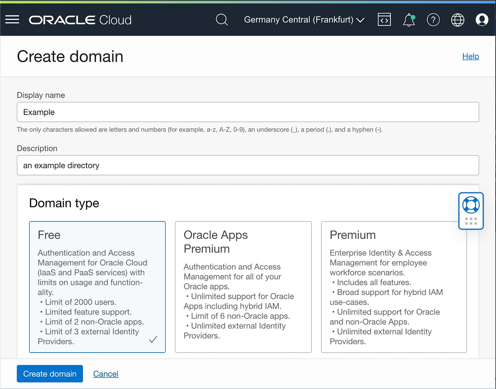
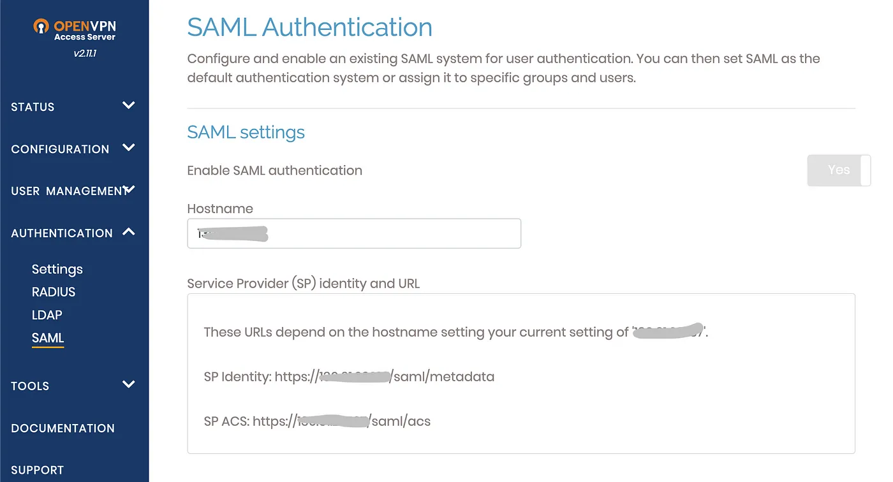
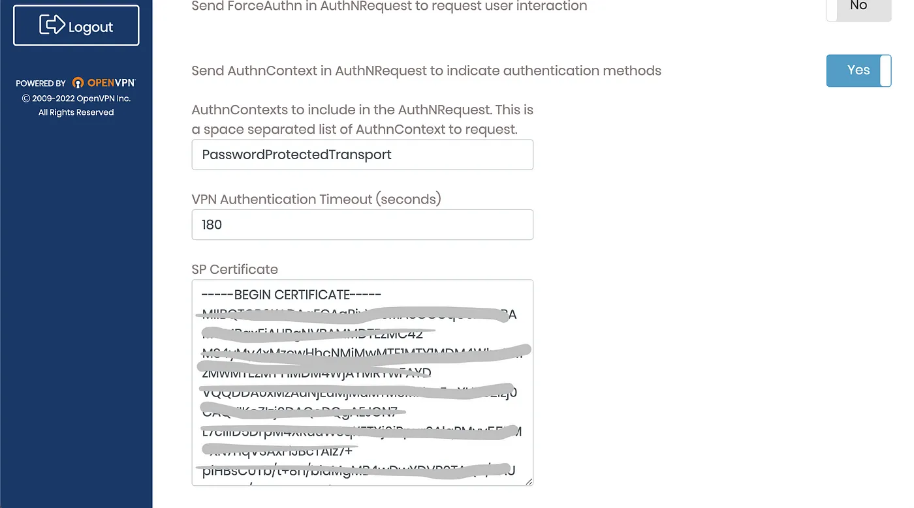
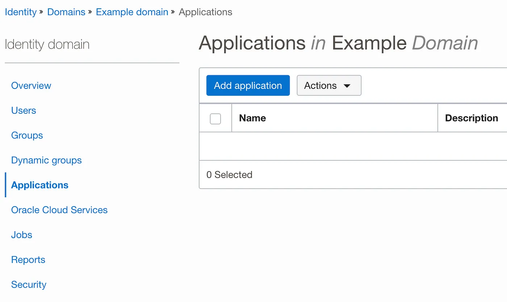
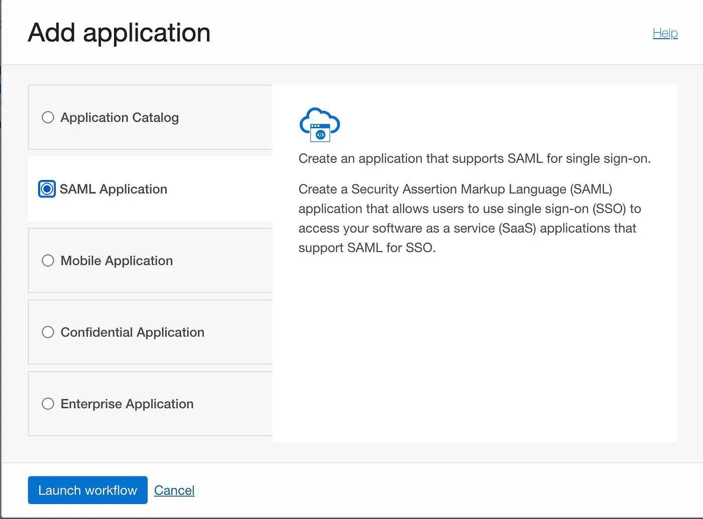
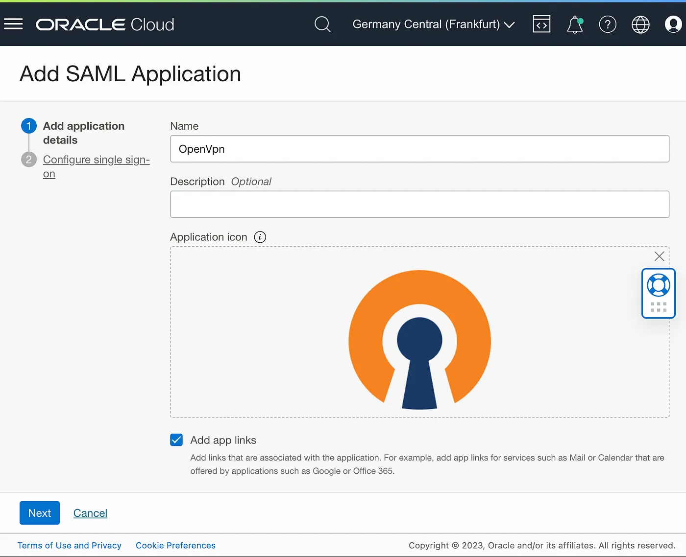
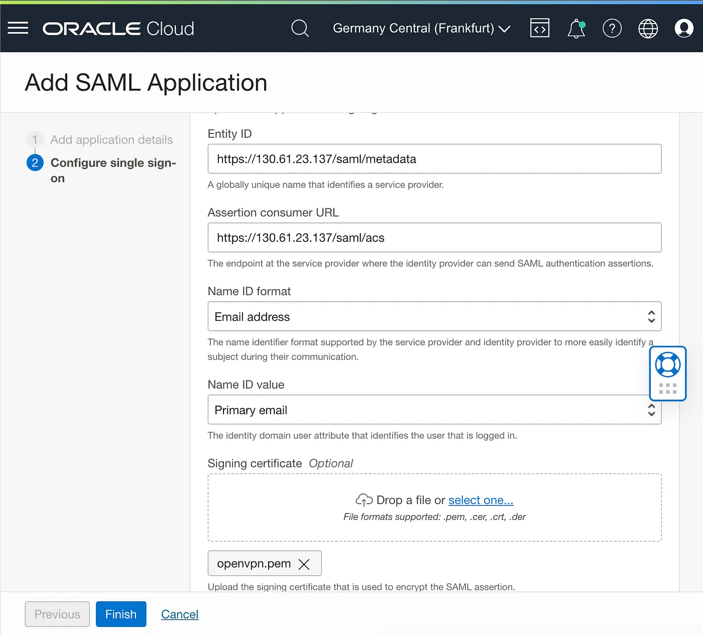

Identity and access management is a crucial goal in a growing organization.

In addition to the requirement to simplify user management and improve security, integrating with external services is becoming increasingly relevant.

Oracle OCI offers a comprehensive service for managing identity and access called [IAM with Identity Domains](https://docs.oracle.com/en-us/iaas/Content/Identity/home.htm)

In the specifics:

>An identity domain is a container for managing users and roles, federating and provisioning of users, secure application integration through Oracle Single Sign-On (SSO) configuration, and SAML/OAuth based Identity Provider administration. It represents a user population in Oracle Cloud Infrastructure and its associated configurations and security settings (such as MFA).

In this post, we look at how we can integrate authentication with MFA with OpenVPN access servers using the OCI IAM identity domain.

To reduce the complexity of the scenario, users and passwords are created directly on a newly separated IAM domain without external directory integration.

We have already created the instance for the OpenVPN appliance on the [OCI compute service](https://docs.oracle.com/en-us/iaas/Content/Compute/home.htm).

The first step is creating the domain in the IAM service, from the menu **Identity & Security -> Domains**

in this scenario, we don’t need to synchronize users from an external directory (AD or LDAP) and the free type is sufficient, in a real company workload the Oracle App Premium domain type is warmly recommended.

Follow the forms and add your primary account details, after some seconds the directory is created with your user as the first user created.

You need to get some data from the OpenVPN admin console and store it somewhere.

Save the SP Identity and SP ACS from the OpenVPN admin web console SAML section

and copy the SP Certificate to a local file _certificate.pem_ from the same page

Now to integrate the OpenVPN access server we need to add a new domain application from the Application form.

and choose the SAML application:

Add Name and optionally the custom icon and press Next, all other options are optional.

Put _Entiy ID, Assertion consumer URL,_ and upload the _certificate.pem_ saved before, push the Finish button.

Download the IdP metadata file from the IAM identity domain button

and upload the metadata file downloaded from the IAM identity domain to the OpenVPN SAML page IdP section

The SAML configuration is finished!

Please turn ON the SAML authentication in the OpenVPN section to enable it.

Now you can try the SAML authentication from the OpenVPN web page.