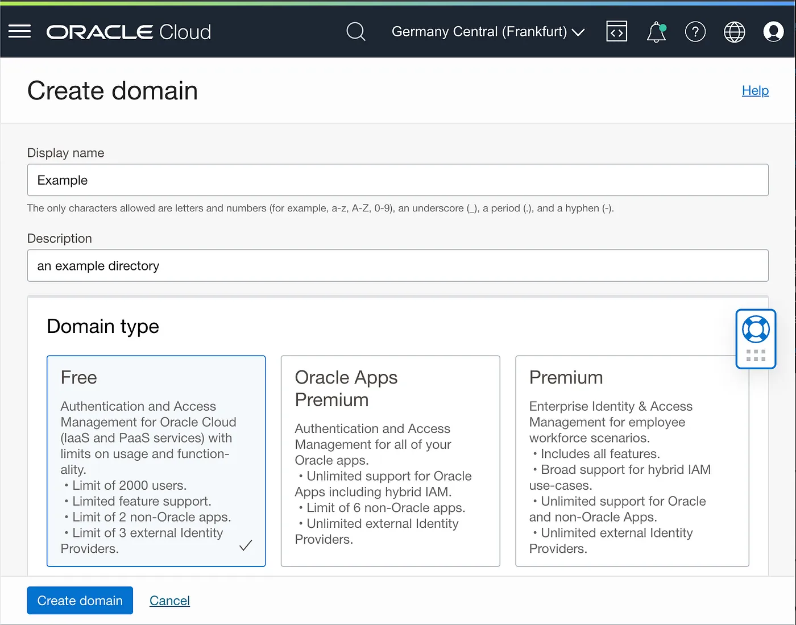
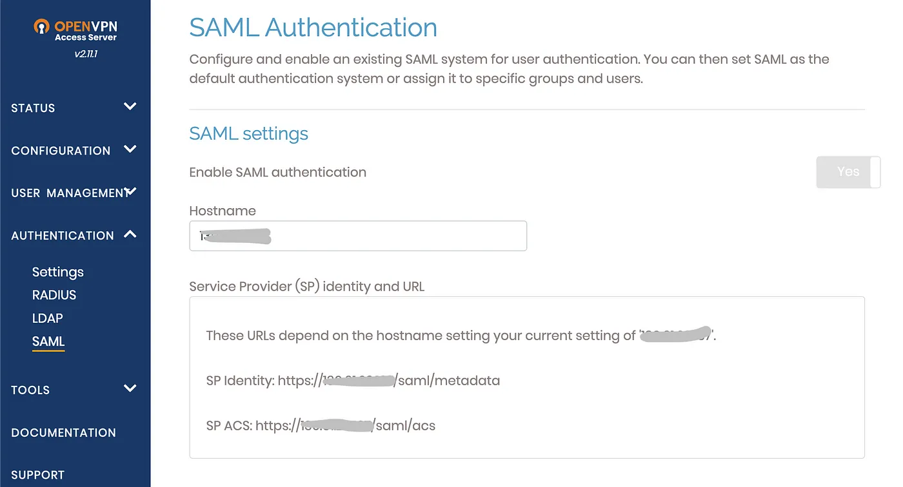
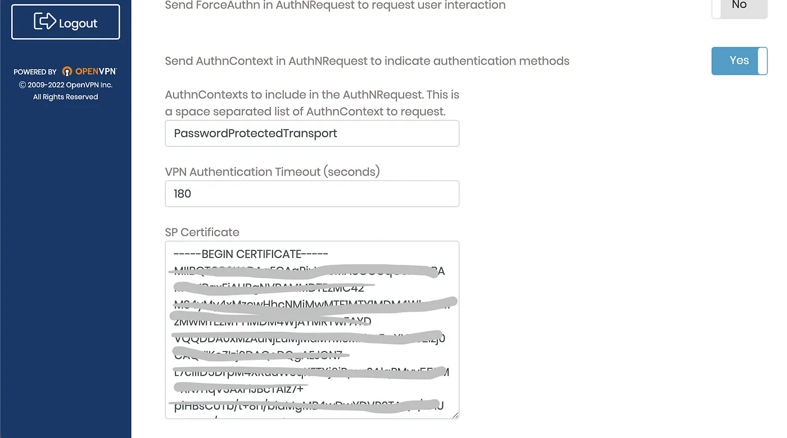
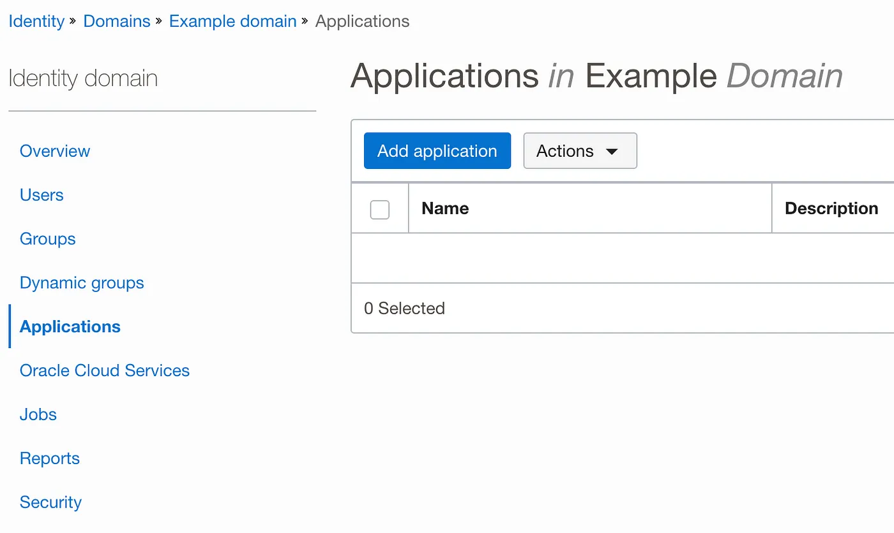
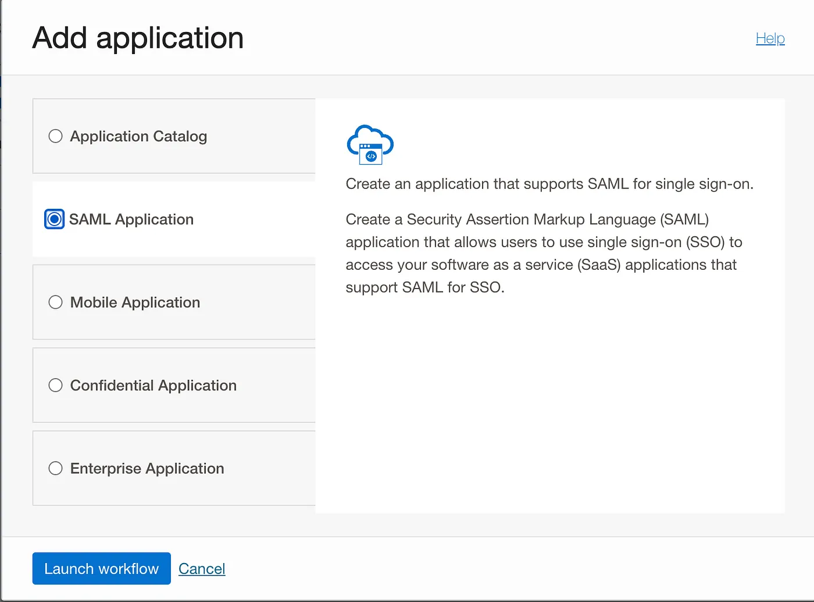
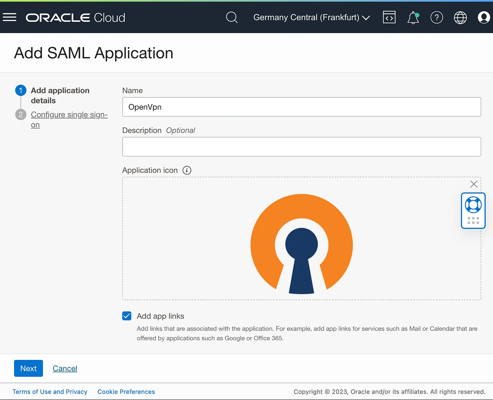
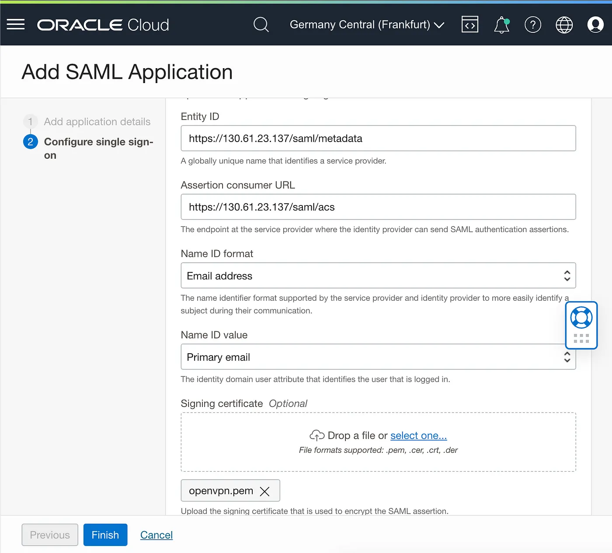
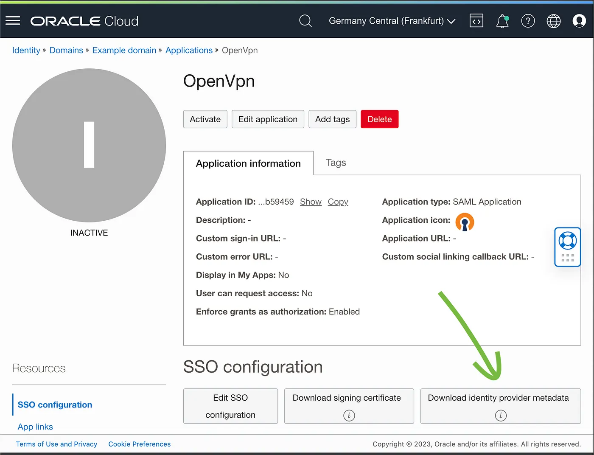

La gestione di identita' e accessi e' un obiettivo cruciale in un'organizzazione che cresce.

Oltre alla necessita' di semplificare la gestione degli utenti e migliorare la sicurezza, l'integrazione con servizi esterni diventa sempre piu' rilevante.

Oracle OCI offre un servizio completo per gestire identita' e accesso chiamato [IAM with Identity Domains](https://docs.oracle.com/en-us/iaas/Content/Identity/home.htm).

Nel dettaglio:

> Un identity domain e' un contenitore per gestire utenti e ruoli, federare e fare provisioning degli utenti, integrare applicazioni tramite Oracle Single Sign-On (SSO) e amministrare provider SAML/OAuth. Rappresenta una popolazione di utenti in Oracle Cloud Infrastructure e le relative impostazioni di sicurezza, come MFA.

In questo post vediamo come integrare l'autenticazione con MFA di OpenVPN Access Server usando un dominio OCI IAM Identity.

Per ridurre la complessita' dello scenario, utenti e password sono creati direttamente in un nuovo dominio IAM separato, senza integrazione con directory esterne.

Partiamo da un'istanza gia' creata per l'appliance OpenVPN sul servizio [OCI Compute](https://docs.oracle.com/en-us/iaas/Content/Compute/home.htm).

Il primo passaggio e' creare il dominio nel servizio IAM dal menu **Identity & Security -> Domains**.

In questo scenario non dobbiamo sincronizzare utenti da una directory esterna, come AD o LDAP, e il tipo gratuito e' sufficiente. In un workload aziendale reale e' invece consigliato il dominio Oracle App Premium.

Segui i form e inserisci i dettagli dell'account principale. Dopo pochi secondi la directory viene creata con il tuo utente come primo utente.

Ora devi recuperare alcuni dati dalla console amministrativa di OpenVPN e salvarli.

Salva **SP Identity** e **SP ACS** dalla sezione SAML della console web amministrativa di OpenVPN.

Copia anche il certificato SP in un file locale chiamato _certificate.pem_ dalla stessa pagina.

Per integrare OpenVPN Access Server dobbiamo aggiungere una nuova applicazione nel dominio.

Scegli l'applicazione SAML:

Inserisci il nome e, opzionalmente, un'icona personalizzata. Premi **Next**; le altre opzioni sono facoltative.

Inserisci _Entity ID_ e _Assertion Consumer URL_, carica il file _certificate.pem_ salvato prima e premi **Finish**.

Scarica il file dei metadati IdP dal pulsante del dominio IAM Identity.

Carica il file dei metadati scaricato dal dominio IAM Identity nella sezione IdP della pagina SAML di OpenVPN.

La configurazione SAML e' completa.

Attiva l'autenticazione SAML nella sezione OpenVPN per abilitarla.

Ora puoi provare l'autenticazione SAML dalla pagina web di OpenVPN.
