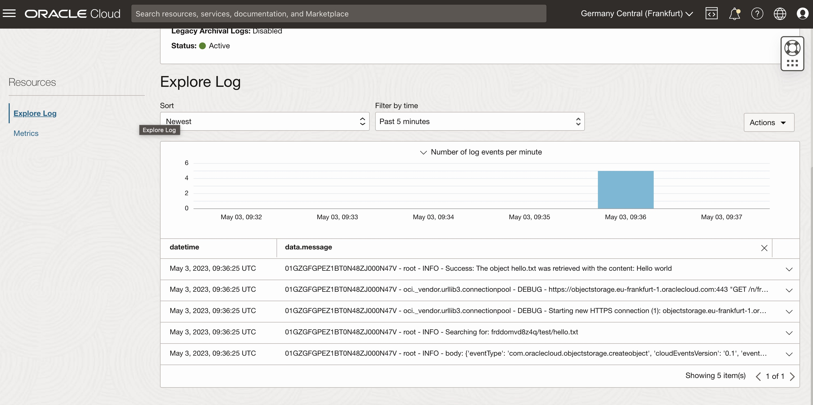

Il servizio OCI Function permette di eseguire del codice su una infrastruttura che non devi gestire. In questo [link]() ho presentato un esempio base di una OCI function sviluppata in Python.

Le funzioni possono essere invocate manualmente o anche automaticamente da altri servizi attraverso un trigger, quindi possiamo eseguire del codice anche in risposta ad una azione nel cloud di OCI.

In questo caso andremo a vedere come invocare una funzione tramite un evento scatenato da un altro servizio di OCI, nello specifico quando copiamo un file all'interno di un Object Storage.

Per permettere una facile comprensione e riproducibilita' ho creato un [template Terraform](https://github.com/enricopesce/fn-examples/tree/main/bucket-event) che permettera' di creare tutte le risorse necessarie.

Una volta creata l'infrastruttura possiamo testare l'esecuzione della funzione func.py inserendo un file all'interno di un bucket.

```console
echo "Hello world!" > hello.txt
oci os object put --bucket-name test --file hello.txt
```

Una volta copiato il file verra' quindi azionata la funzione e attraverso i log potremmo verificare l'esecuzione e l'output



Questo esempio abbastanza banale puo' far comprendere come attraverso gli eventi si possa creare automatismi ed accedere a file in modo dinamico e scalabile.

In scenari piu complessi sara' possibile integrare altri servizi di OCI per elaborare o estrarre dati dai documenti salvati in un Bucket e salvarli ad esempio in altri servizi come Autonomous DB.