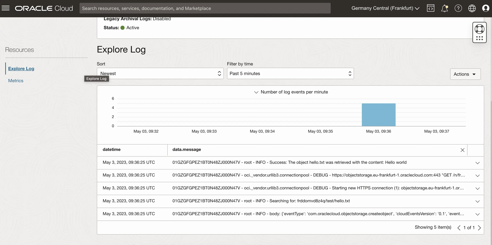

Il servizio OCI Functions permette di eseguire codice su infrastruttura che non devi gestire. In questo [articolo]() ho presentato un esempio base di OCI Function sviluppata in Python.

Una funzionalita' molto interessante e' che le funzioni possono essere invocate automaticamente da altri servizi tramite un evento. Possiamo quindi eseguire codice in risposta a un'azione nel cloud OCI oppure usare una function come collegamento tra piu' servizi cloud che compongono un workload complesso.

In questo caso vediamo come invocare una funzione tramite un evento generato da un altro servizio OCI, nello specifico quando copiamo un file in Object Storage.

Con l'aumento della complessita' infrastrutturale introduciamo anche un nuovo concetto chiamato [IaC](https://it.wikipedia.org/wiki/Infrastructure_as_Code), utile per facilitare il deployment delle configurazioni cloud. In particolare useremo un [template Terraform](https://github.com/enricopesce/fn-examples/tree/main/bucket-event), ampiamente supportato su OCI.

Eseguiamo quindi i due comandi per creare l'infrastruttura su OCI:

```console
terraform init
terraform apply
```

Una volta creata l'infrastruttura, possiamo testare l'esecuzione della funzione `func.py` inserendo un file nel bucket.

```console
echo "Hello world!" > hello.txt
oci os object put --bucket-name test --file hello.txt
```

Dopo la copia del file, la function viene attivata e tramite i log possiamo verificare esecuzione e output.



Questo esempio abbastanza semplice aiuta a capire come gli eventi permettano di creare automatismi e, in questo caso, accedere ai file in modo dinamico e scalabile.

In scenari piu' complessi e' possibile integrare altri servizi OCI per elaborare o estrarre dati da documenti salvati in un bucket e salvarli, per esempio, in Autonomous DB.

Terminati i test, puoi eliminare l'infrastruttura con Terraform:

```console
terraform destroy
```
