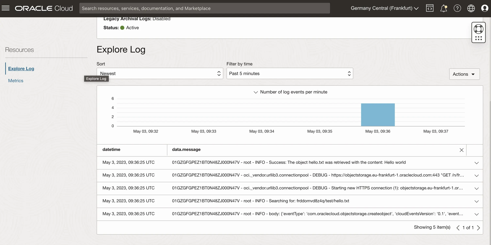

The OCI Function service allows you to run code on infrastructure that you don't have to manage. In this [link]() I presented a basic example of an OCI function developed in Python.

A very interesting feature is that functions can be automatically invoked by other services through an event, so we can also execute code in response to an action in the OCI cloud, or use a function as a link between multiple cloud services that can form a complex workload.

In this case we will see how to invoke a function via an event triggered by another OCI service, in the specific when we copy a file to an Object Storage.

Given the increase in infrastructure complexity we would also introduce a new concept called [IaC](https://it.wikipedia.org/wiki/Infrastructure_as_Code) to facilitate the deployment of all configurations in the cloud, specifically we will use a [template Terraform](https://github.com/enricopesce/fn-examples/tree/main/bucket-event), widely supported on OCI.

So let's run the two commands to create the infrastructure on OCI

```console
terraform init
terraform apply
```

Once the infrastructure has been created, we can test the execution of the func.py function by inserting a file inside the bucket.

```console
echo "Hello world!" > hello.txt
oci os object put --bucket-name test --file hello.txt
```

Once the file has been copied, the function will then be activated and through the logs we could verify the execution and the output



This fairly trivial example can help you to understand how through events you can create automatisms and in this case access files in a dynamic and scalable way.

In more complex scenarios it will be possible to integrate other OCI services to process or extract data from documents saved in a Bucket and save them, for example, in other services such as Autonomous DB.

Once you have finished your tests it will be possible to delete the infrastructure with terraform

```console
terraform destroy
```