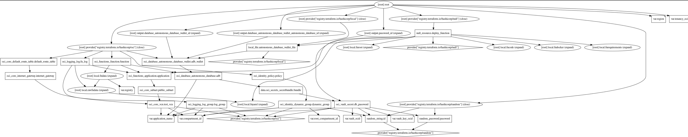

Una volta visto come fare una custom image, nel caso [precedente]() abbiamo installato il client Oracle, ora andiamo a provare a utilizzare questa immagine custom per collegarci ad un database Oracle.

Sfrutteremo al meglio le capacita' del cloud, in questo esempio useremo la metodologia infrastructure as cloud (IaC) per cosi offrire un esempio reale di una architettura facilmente replicabile da tutti.

Il progetto "toautonomous" si trova nello stesso repository GitHub utilizzato finora per parlare di OCI Function [fn-examples](https://github.com/enricopesce/fn-examples/tree/main/toautonomous) nel README del progetto e' descritto la procedura di configurazione dell'infrastruttura.

Se non conosci terraform ti consiglio di consultare la [documentazione ufficiale](https://registry.terraform.io/providers/oracle/oci/latest/docs) e il nostro [tutorial](https://docs.oracle.com/en-us/iaas/developer-tutorials/tutorials/tf-simple-infrastructure/01-summary.htm) e [video](https://www.youtube.com/watch?v=MjmikFgvKvI)

nel mio caso il file terraform.tfvars sara simile a questo (vlori alterati):


tenancy_ocid     = "ocid1.tenancy.oc1..aaaaaaaao4a5a"
region           = "eu-frankfurt—l"
compartment_id   = "ocid1.compartment.oc1..aaaaaaaawdnpdyjvbala"
root_compartment_id   = "ocid1.tenancy.oc1..aaaaaaaa2h4xgua7d4a5a"
registry         = "fra.ocir.io/frddomvd8z4q/functions"
application_name = "toautonomous"
vault_ocid       = "ocid1.vault.oc1.eu-frankfurt-1.dzsgmkchaafmg.abthe2a"
vault_key_ocid   = "ocid1.key.oc1.eu-frankfurt-1.dzsgmkchaafmga2ra"


Il codice [IaC](https://github.com/enricopesce/fn-examples/blob/main/toautonomous/infrastructure.tf) e' stato sviluppato per eseguire tutto il deployment da quello infrastrutturale a quello legato alla build del container custom per la function e il suo rilascio, quindi bastera' all'interno della folder del progetto lanciare il comando

```console
terraform apply
```

Verranno create diverse risorse, non facilmente rappresentate da questo grafico di dipendenze creato con Terraform



La situazione e' piu' semplice di quanto si creda, le risorse OCI principali che andremo a utilizzare sono:

* VCN
* Autonomous DB
* Function
* Vault
* Logging

Da far presente che la funzione prima di essere costruita attendera' la creazione del database e includera' il wallet di autenticazione all'interno della function image, in modo similare la password di amministrazione dell'utente verra' salvata e crittografata all'interno del servizio Vault e ottenuta run-time dalla funzione quando necessario senza dover salvare dati di credenziali nel codice.

Queste implementazioni rendono il progetto d'esempio molto sicuro.

Qui il file della [funzione](https://github.com/enricopesce/fn-examples/blob/main/toautonomous/func.py) per comprendere meglio il funzionamento.

