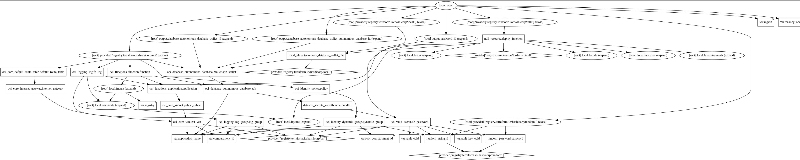

After seeing how to create a custom image, in the [previous case]() where we installed the Oracle client, now let's try to use this custom image to connect to an Oracle database.

We will make the most of the cloud capabilities. In this example, we will use the Infrastructure as Code (IaC) methodology to provide a real example of an easily replicable architecture for everyone.

The "toautonomous" project is in the same GitHub repository used so far to talk about OCI Function [fn-examples](https://github.com/enricopesce/fn-examples/tree/main/toautonomous). The project's README describes the infrastructure configuration procedure.

If you are not familiar with Terraform, I recommend referring to the [official documentation](https://registry.terraform.io/providers/oracle/oci/latest/docs) and our [tutorial](https://docs.oracle.com/en-us/iaas/developer-tutorials/tutorials/tf-simple-infrastructure/01-summary.htm) and [video](https://www.youtube.com/watch?v=MjmikFgvKvI).

In my case, the terraform.tfvars file will be similar to this (values altered):


tenancy_ocid = "ocid1.tenancy.oc1..aaaaaaaao4a5a"
region = "eu-frankfurt—l"
compartment_id = "ocid1.compartment.oc1..aaaaaaaawdnpdyjvbala"
root_compartment_id = "ocid1.tenancy.oc1..aaaaaaaa2h4xgua7d4a5a"
registry = "fra.ocir.io/frddomvd8z4q/functions"
application_name = "toautonomous"
vault_ocid = "ocid1.vault.oc1.eu-frankfurt-1.dzsgmkchaafmg.abthe2a"
vault_key_ocid = "ocid1.key.oc1.eu-frankfurt-1.dzsgmkchaafmga2ra"


The [IaC](https://github.com/enricopesce/fn-examples/blob/main/toautonomous/infrastructure.tf) code has been developed to handle the entire deployment, from infrastructure to building the custom container for the function and its release. Therefore, within the project folder, simply run the command:

Various resources will be created, not easily represented by this dependency graph created with Terraform:

The situation is simpler than you might think. The main OCI resources we will use are:

- VCN
- Autonomous DB
- Function
- Vault
- Logging

It's worth mentioning that before being built, the function will wait for the database to be created and will include the authentication wallet inside the function image. Similarly, the administrative user's password will be saved and encrypted within the Vault service and obtained at runtime by the function when needed, without saving credential data in the code.

These implementations make the example project very secure.

Here is the [function file](https://github.com/enricopesce/fn-examples/blob/main/toautonomous/func.py) to better understand its operation.
