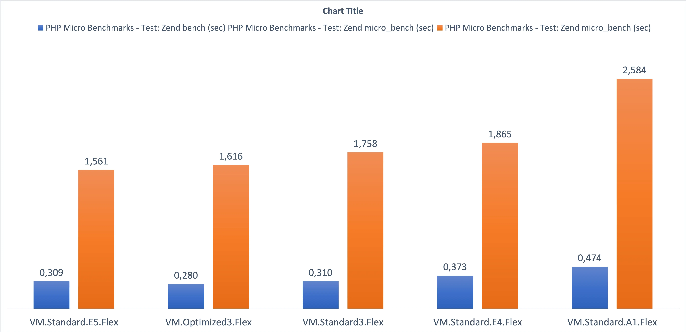

Tempo fa ho sviluppato un [tool](https://github.com/enricopesce/php-performance) con l'obiettivo di valutare il reale miglioramento di performance tra diverse versioni di PHP. Successivamente ho cercato di capire quale tipo di istanza AWS fosse piu' performante. Poiche' AWS non permette una personalizzazione libera di CPU e RAM, volevo esplorare le differenze tra le varie istanze e capire quale fosse piu' conveniente.

Durante le vacanze ho esteso questo progetto e ho svolto la stessa analisi con [OCI](https://www.oracle.com/it/cloud/), Oracle Cloud Infrastructure.

La differenza significativa rispetto ad AWS e' che con OCI e' possibile scegliere la shape, cioe' la tecnologia sottostante, e poi selezionare in modo flessibile CPU e RAM. I test sono quindi condotti sulle singole shape, invece che su un numero elevato di tipi di istanza.

Per approfondire, le shape disponibili sono:

### Shape basate su tecnologia AMD

* **VM.Standard.E4.Flex** (Processore: AMD EPYC 7J13. Frequenza base 2,55 GHz, boost massimo 3,5 GHz)
* **VM.Standard.E5.Flex** (Processore: AMD EPYC 9J14. Frequenza base 2,4 GHz, boost massimo 3,7 GHz)

### Shape basate su tecnologia Intel

* **VM.Standard3.Flex** (Processore: Intel Xeon Platinum 8358. Frequenza base 2,6 GHz, turbo massimo 3,4 GHz)
* **VM.Optimized3.Flex** (Processore: Intel Xeon 6354. Frequenza base 3,0 GHz, turbo massimo 3,6 GHz)

### Shape basate su tecnologia ARM64 Ampere

* **VM.Standard.A1.Flex** (ogni OCPU corrisponde a un singolo thread hardware. Processore: Ampere Altra Q80-30. Frequenza massima 3,0 GHz)

*Per chiarezza, in questo test non sono state selezionate shape bare metal, ma solo macchine virtuali.*

Il test esegue una suite di benchmark open source, la [Phoronix Test Suite](https://www.phoronix-test-suite.com/), usando due test PHP specifici:

* [PHP Micro Benchmarks](https://openbenchmarking.org/test/pts/php)
* [PHPBench](https://openbenchmarking.org/test/pts/phpbench)

Il test e' di tipo single-threaded. Non valutiamo quindi quanto un server possa scalare su piu' thread o CPU; ci concentriamo invece sulla velocita' di esecuzione di uno script PHP nel suo comportamento naturale a singolo thread.

In sintesi, il test usa una singola OCPU e 16 GB di RAM. Test con un numero maggiore di OCPU non produrrebbero ottimizzazioni in questo scenario specifico, perche' non verrebbero utilizzate.

Al momento non ho usato le ultime versioni PHP dal noto [repository Remi](https://blog.remirepo.net/), ma le versioni PHP ufficiali incluse nella distribuzione [Oracle Linux](https://yum.oracle.com/oracle-linux-php.html). In futuro vorrei testare anche soluzioni esterne piu' recenti.

### I risultati per PHP 8.0 sono i seguenti:

Possiamo osservare che la nuova shape **VM.Standard.E5.Flex** risulta leggermente vincente anche rispetto a Intel, affermandosi come la shape piu' veloce per eseguire script PHP. Al secondo e terzo posto troviamo **VM.Optimized3.Flex** e **VM.Standard3.Flex**, cioe' le due shape Intel disponibili.

In penultima posizione c'e' la precedente tecnologia AMD, **VM.Standard.E4.Flex**, mentre l'ultima posizione e' di **VM.Standard.A1.Flex**. In questo caso servirebbe approfondire se il risultato sia influenzato anche da una non perfetta ottimizzazione delle vecchie versioni PHP per tecnologia ARM.

Possiamo dichiarare la nuova **VM.Standard.E5.Flex** vincitrice assoluta, non solo in termini di performance ma anche di costo. Sul podio i costi per ogni shape sono:

1. B97384 Compute - Standard - E5 - OCPU **20,76 euro al mese**
2. B93311 Compute - Optimized - X9 - OCPU **37,36 euro al mese**
3. B94176 Compute - Standard - X9 - OCPU **27,68 euro al mese**

*I costi derivano dal [cloud cost estimator](https://www.oracle.com/it/cloud/costestimator.html) a gennaio 2024.*

**La tecnologia E5, oltre a essere la piu' veloce, e' anche la piu' economica sul podio.**

Vale comunque la pena notare che la shape **VM.Standard.A1.Flex**, arrivata ultima, e' anche la piu' economica in assoluto, con un costo stimato di soli **6,70 euro** al mese.

Idee per un futuro articolo includono il test delle ultime versioni PHP dal repository Remi e la verifica di eventuali migliori performance su ARM. Sarebbe interessante anche capire se, in workload multiprocessore, ARM possa superare x86 in termini di performance.
