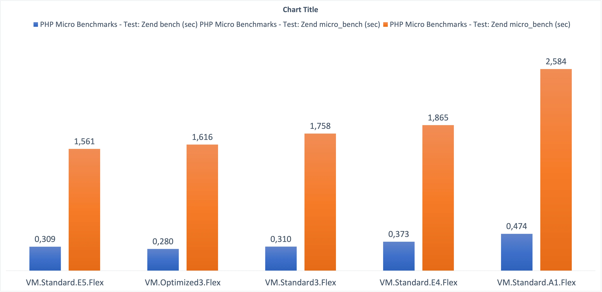

A while ago, I developed a [tool](https://github.com/enricopesce/php-performance) with the aim of assessing the actual performance improvement between different versions of PHP. Subsequently, I search to understand which AWS instance type was the most performant. Since AWS does not allow for custom sizing of CPU and RAM resources, I wanted to explore the differences among the various instance types and determine which one would be most cost-effective to choose.

During the holiday season, I dedicated myself to expanding this project and doing the same analysis with [OCI](https://www.oracle.com/it/cloud/), Oracle Cloud Infrastructure.

The significant difference compared to AWS is that with OCI, it's possible to choose the shape, i.e., the underlying technology, and then flexibly select the amount of CPU and RAM to use. Therefore, the tests will be conducted on the various individual shapes rather than an extensive number of instance types.

To understand deeper, the available shapes are as follows:

#### Shapes based on AMD technology

* **VM.Standard.E4.Flex** (Processor: AMD EPYC 7J13. Base frequency 2.55 GHz, max boost frequency 3.5 GHz)
* **VM.Standard.E5.Flex** (Processor: AMD EPYC 9J14. Base frequency 2.4 GHz, max boost frequency 3.7 GHz)

#### Shapes based on INTEL technology

* **VM.Standard3.Flex** (Processor: Intel Xeon Platinum 8358. Base frequency 2.6 GHz, max turbo frequency 3.4 GHz)
* **VM.Optimized3.Flex** (Processor: Intel Xeon 6354. Base frequency 3.0 GHz, max turbo frequency 3.6 GHz)

#### Shapes based on ARM64 AMPERE technology

* **VM.Standard.A1.Flex** (Each OCPU corresponds to a single hardware execution thread. Processor: Ampere Altra Q80-30. Max frequency 3.0 GHz.)

*To specify, bare metal shapes were not selected in this test, only virtual machines.*

Our test will run through a suite of open-source benchmarks, the [Phoronix Test Suite](https://www.phoronix-test-suite.com/), using two specific PHP tests:

* [PHP Micro Benchmarks](https://openbenchmarking.org/test/pts/php)
* [PHPBench](https://openbenchmarking.org/test/pts/phpbench)

The test is of the Single-Threaded type. Therefore, we won't be assessing how well a server can scale across multiple threads or CPUs. Instead, our focus will be on precisely measuring how quickly a PHP script is executed in its natural single-threaded execution.

In summary, the test will be conducted with a single OCPU and 16 gigabytes of RAM. Tests with a greater number of OCPUs will not yield any performance optimizations since they won't be utilized in this specific scenario.

Currently, I have not used the latest versions of PHP from the well-known [Remi's repository](https://blog.remirepo.net/), but instead, I have utilized the official PHP versions included in the [Oracle Linux distribution](https://yum.oracle.com/oracle-linux-php.html). In the future, I intend to test more recent external solutions as well.

### The results for PHP 8.0 are as follows:

We can observe that the new **VM.Standard.E5.Flex** shape emerges (slightly) victorious even over Intel, establishing itself as the fastest shape for executing PHP scripts. In the second and third positions are **VM.Optimized3.Flex** and **VM.Standard3.Flex**, which are the two available Intel shapes.

In the penultimate position is the previous AMD technology shape, **VM.Standard.E4.Flex**, and in the last position is **VM.Standard.A1.Flex**. In this case, further investigation is needed to determine if this placement is also influenced by any suboptimal optimization of older PHP versions for ARM technology.

We can declare the new **VM.Standard.E5.Flex** shape the overall winner, not only in terms of performance but also in cost. In the podium, the costs for each shape are as follows:

1) B97384 Compute - Standard - E5 - OCPU **€20.76 monthly cost**
2) B93311 Compute - Optimized - X9 - OCPU **€37.36 monthly cost**
3) B94176 Compute - Standard - X9 - OCPU **€27.68 monthly cost**

*The costs are derived from the [cloud cost estimator](https://www.oracle.com/it/cloud/costestimator.html) as of January 2024.*

**E5 technology, besides being the fastest, is also the most economical on the podium!**

However, it's worth noting that the last-placed **VM.Standard.A1.Flex** is also the most economical overall, costing only **€6.70** per month estimated.

Ideas for a future article include testing the latest versions of PHP from the Remi repository (https://blog.remirepo.net/) and understanding if ARM technology can provide higher performance. Additionally, it would be interesting to verify if, in a multiprocessor workload, ARM outperforms x86 in terms of performance.