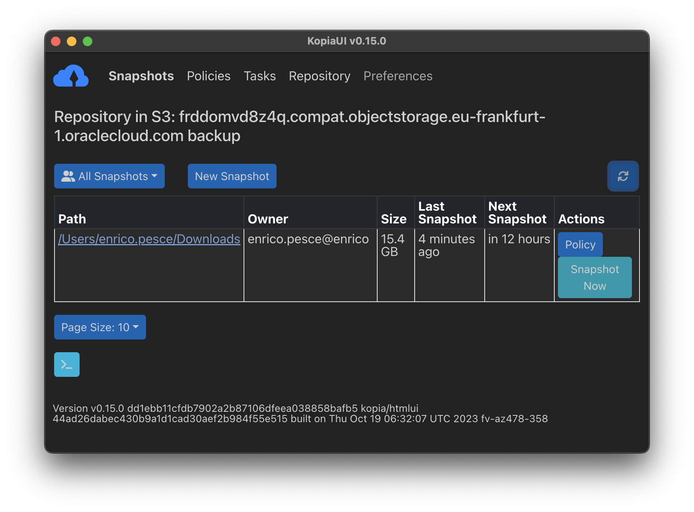
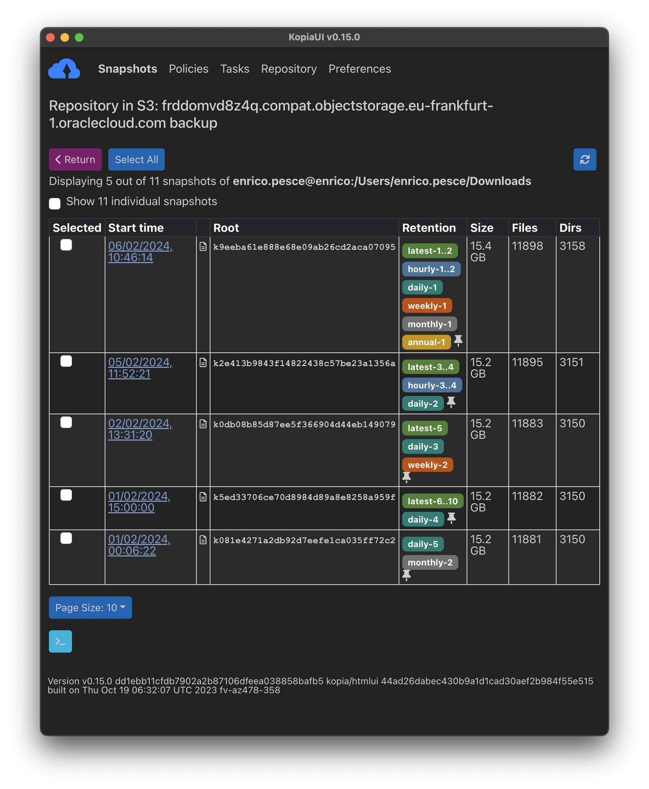
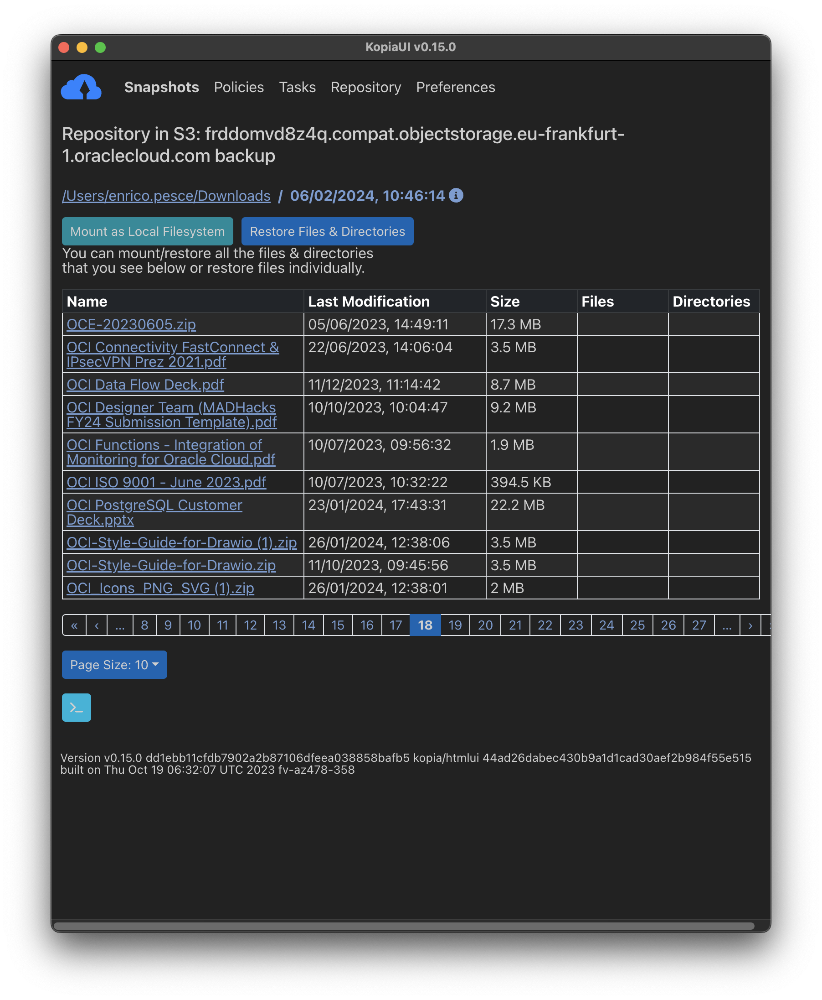
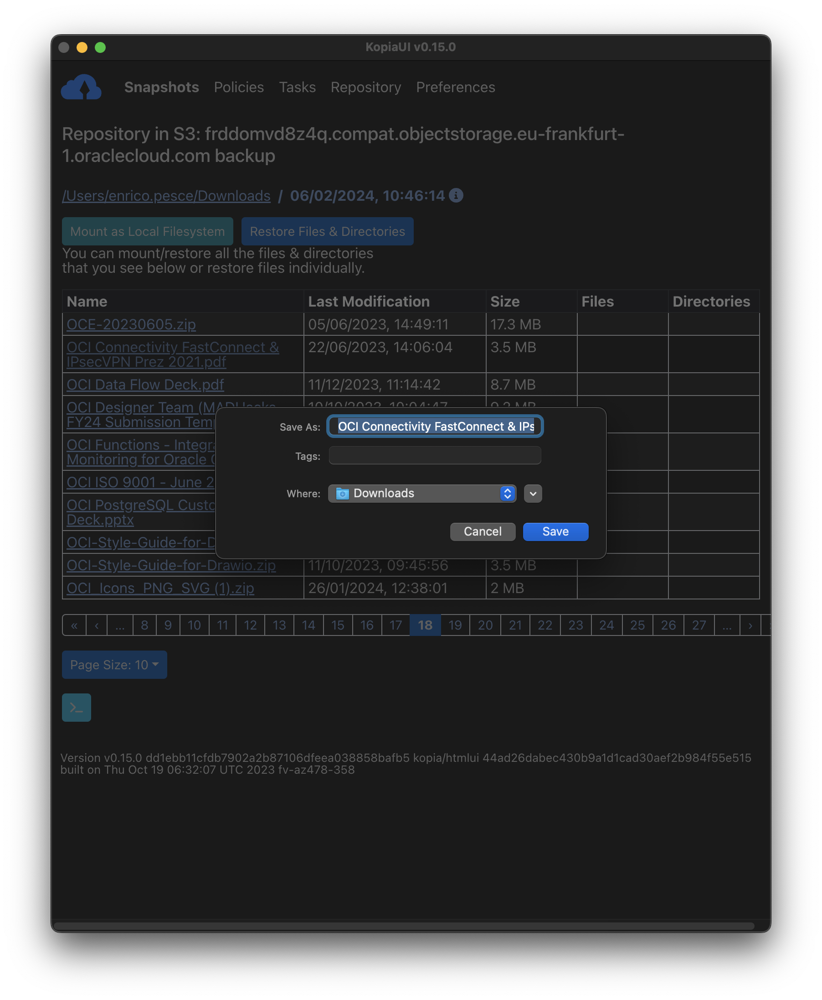
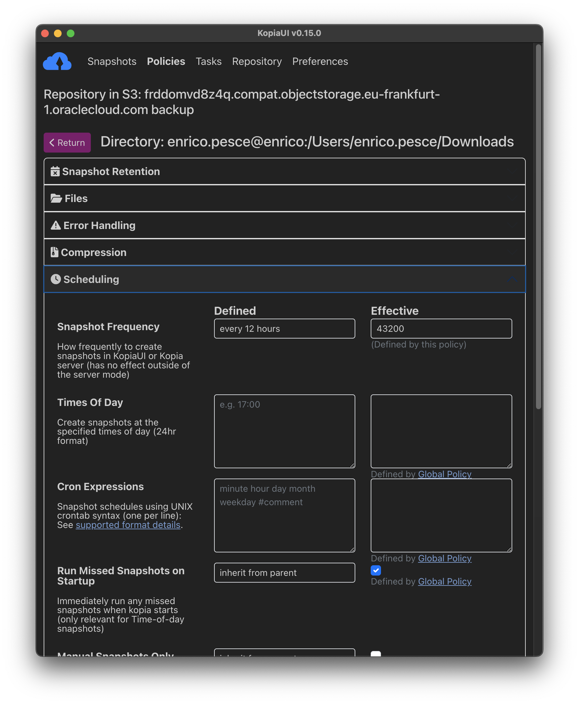

Mi capita spesso di ricevere delle domande riguardanti il backup dei dati su OCI che ibridio includendo sistemi esterni.

Rcentemente ho testato [Kopia.io](kopia.io) e la sua compatilibta' con OCI e visto il successo dei miei test voglio condividere con voi quanto ottenuto.

Dai test intercorsi non ho avuto alcun problema ad integrarlo con il nostro Object Storage sfruttando la [compatibilita' API S3](https://docs.oracle.com/en-us/iaas/Content/Object/Tasks/s3compatibleapi.htm).

Il servizio object storage possiede diversi [endpoints](https://docs.oracle.com/en-us/iaas/Content/Object/Concepts/dedicatedendpoints.htm) che permettono di sfuttare il servizio emulando diversi tipi di API al momento i supportati sono:

- Nativo
- S3 compatibile
- Swift (OpenStack Object Storage)
- PARs (Pre-Authenticated Requests)

Kopia supporta diversi storage che tratta come [repositories](https://kopia.io/docs/repositories/) il supporto include molti servizi cloud esistenti ma inoltre e' possibile gestire privatamente un repo privato attraverso un [Kopia Repository Server](https://kopia.io/docs/repository-server/) non utilizzando quindi dei servizi cloud pubblici ma per esempio una VM privata.

Nel mio test ho voluto provare OCI Object Storage, vi lascio qui la guida di [installazione](https://kopia.io/docs/installation/) di Kopia.

Una volta installato ho seguito il semplice [getting-started](https://kopia.io/docs/getting-started/)

Servono essenzialmente queste informazioni di OCI per proseguire alla creazione di un repository S3 su Kopia:

- bucket namespace
- region name

che andranno a formare l'endpoint address completo delle API compatibili S3:

**{bucketnamespace}.compat.objectstorage.{region}.oraclecloud.com**

inoltre serviranno

- il nome del bucket
- utente con i diritti di accesso con [cusomter access e secret key](https://docs.oracle.com/en-us/iaas/Content/Identity/Tasks/managingcredentials.htm#Working2)

Il comando una volta ottenute le informazioni sara' il seguente (le keys sono "mascherate"):

```console
enrico.pesce@enrico ~ % kopia repository create s3 \
  --bucket=backup \
  --region=eu-frankfurt-1 \
  --endpoint=frddomvd8z4q.compat.objectstorage.eu-frankfurt-1.oraclecloud.com \
  --access-key=3fdsfdsfdsfsdf4543gtfreterter \
  --secret-access-key=dsdsadsadsadasdasdasdau7LF/KEjKZDhb8Q=
```

Se vogliamo testare Objec Storage e la sua compatiblita' e' possibile lanciare un test che andra' a fare le operazioni I/O nel repository:

```console
enrico.pesce@enrico ~ % kopia repository validate-provider
Opening 4 equivalent storage connections...
Validating storage capacity and usage
Validating blob list responses
Validating non-existent blob responses
Writing blob (5000000 bytes)
Validating conditional creates...
Validating list responses...
Validating partial reads...
Validating full reads...
Validating metadata...
Running concurrency test for 30s...
All good.
Cleaning up temporary data...
```

Se e' andato tutto bene come in questo caso possiamo decidere di connetterci al repository per utilizzarlo:

```console
enrico.pesce@enrico ~ % kopia repository connect s3 \
  --bucket=backup \
  --region=eu-frankfurt-1 \
  --endpoint=frddomvd8z4q.compat.objectstorage.eu-frankfurt-1.oraclecloud.com \
  --access-key=3fdsfdsfdsfsdf4543gtfreterter \
  --secret-access-key=dsdsadsadsadasdasdasdau7LF/KEjKZDhb8Q=
```

Per verificare alcune informazioni tra cui un utile snippet per ricollegarci senza usare le credenziali in chiaro:

```console
enrico.pesce@enrico ~ % kopia repository status -t -s
Config file:         /Users/enrico.pesce/Library/Application Support/kopia/repository.config

Description:         Repository in S3: frddomvd8z4q.compat.objectstorage.eu-frankfurt-1.oraclecloud.com backup
Hostname:            enrico
Username:            enrico.pesce
Read-only:           false
Format blob cache:   15m0s

Storage type:        s3
Storage capacity:    unbounded
Storage config:      {
                       "bucket": "backup",
                       "endpoint": "frddomvd8z4q.compat.objectstorage.eu-frankfurt-1.oraclecloud.com",
                       "accessKeyID": ....

...To reconnect to the repository use:

$ kopia repository connect from-config --token eyJ2ZXJzaW9uIjoiMSIsInN0b3JhZ2UiOnsidHlwZSI6InMzIiwiY29uZmlnIjp7ImJ1Y2tldCI6ImJhY2t1cCIsImVuZHBvaW50IjoiZnJkZG9tdmQ4ejRxLmNvbXBhdC5vYmplY3RzdG9yYWdlLmVdsgfdsgdfsgfdsgo537hn9058jg9v-5869g5k89d-kf8946578bj06vfm056jvk0y458bnj908jg9v6k8fy989f658965jgy968jg94586b9k4869g84y6hgb8j69b8hj69hk8g95687h969bmtiomgufiunfbter
```

Ora abbiamo un repository dove salvare i nostri dati con Kopia, ad esempio possiamo creare un backup di una folder con questo comando molto semplice usando le impostazioni di default:

```console
enrico.pesce@enrico ~ % kopia snapshot create $HOME/Downloads
Snapshotting enrico.pesce@enrico:/Users/enrico.pesce/Downloads ...
 * 0 hashing, 0 hashed (0 B), 5175 cached (14 GB), uploaded 202 B, estimating...
Created snapshot with root k24214076e958e761485b2af904f03b0b and ID de70da14f1c0264b3cbc4016dee67a7f in 0s
```

una volta terminato il processo di copia sara' gia possibile listare le snapshot create, nel mio caso dopo alcuni giorni:

kopia snapshot list $HOME

```console
enrico.pesce@enrico ~ % kopia snapshot list $HOME/Downloads
enrico.pesce@enrico:/Users/enrico.pesce/Downloads
  2024-02-01 00:06:22 CET k081e4271a2db92d7eefe1ca035ff72c2 15.2 GB drwx------ files:11881 dirs:3150 (daily-5,monthly-2)
  2024-02-01 15:00:00 CET k5ed33706ce70d8984d89a8e8258a959f 15.2 GB drwx------ files:11882 dirs:3150 (latest-6..10,daily-4)
  + 4 identical snapshots until 2024-02-02 01:03:16 CET
  2024-02-02 13:31:20 CET k0db08b85d87ee5f366904d44eb149079 15.2 GB drwx------ files:11883 dirs:3150 (latest-5,daily-3,weekly-2)
  2024-02-05 11:52:21 CET k2e413b9843f14822438c57be23a1356a 15.2 GB drwx------ files:11895 dirs:3151 (latest-3..4,hourly-3..4,daily-2)
  + 1 identical snapshots until 2024-02-05 13:00:00 CET
  2024-02-06 10:46:14 CET k9eeba61e888e68e09ab26cd2aca07095 15.4 GB drwx------ files:11898 dirs:3158 (latest-1..2,hourly-1..2,daily-1,weekly-1,monthly-1,annual-1)
  + 1 identical snapshots until 2024-02-06 13:00:00 CET
```

Se non siete amanti della console vi consiglio di utilizzare una semplice e comoda GUI [KopiaUI](https://github.com/kopia/kopia/releases/tag/v0.15.0) molto intiutiva e semplice, qui di seguito alcuni screenshot:

 dove si possono verificare le folder protette 

visualizzare tutte le iterazioni del backup di volta in volta con comodi tags colorati:

la lista dei file protetti

il ripristino di files e' molto semplice

la configurazione delle policy e' molto completo e granulare


Non ti resta altro che provare Kopia e testarlo anche tu su OCI!