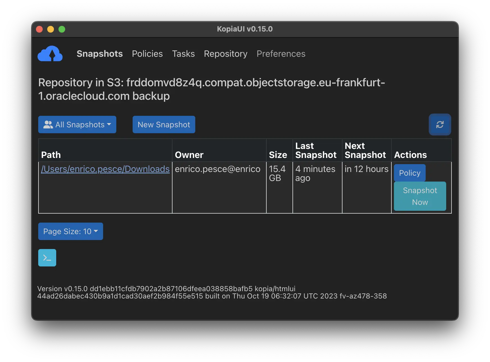
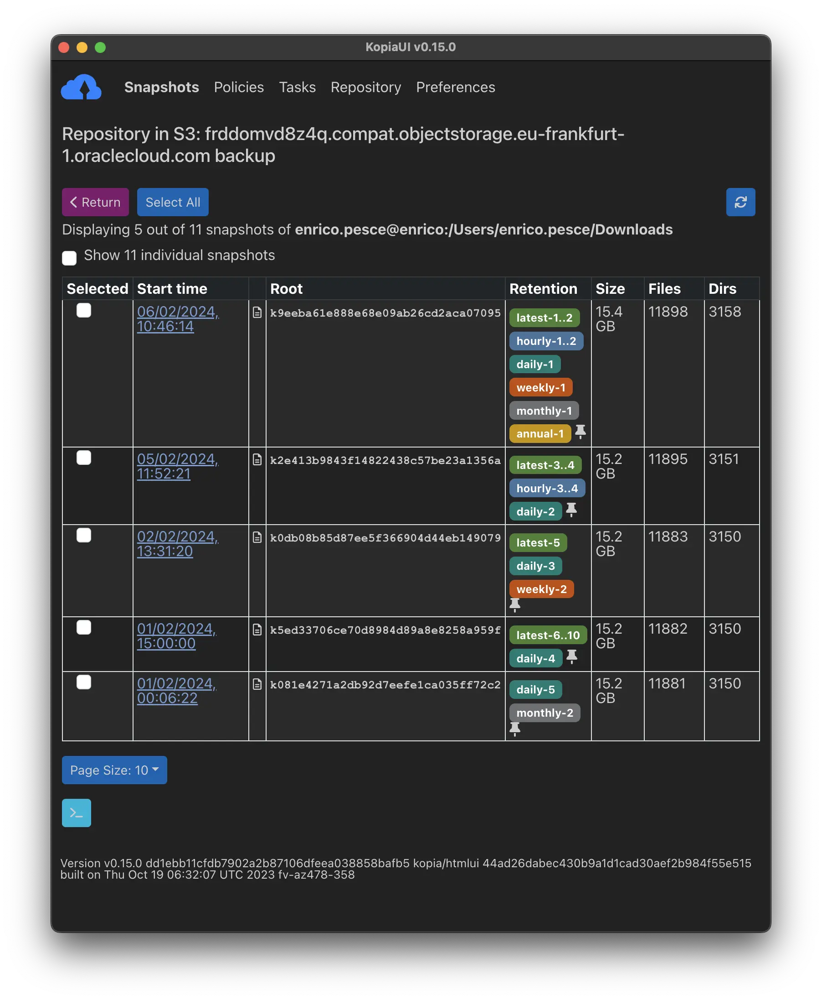
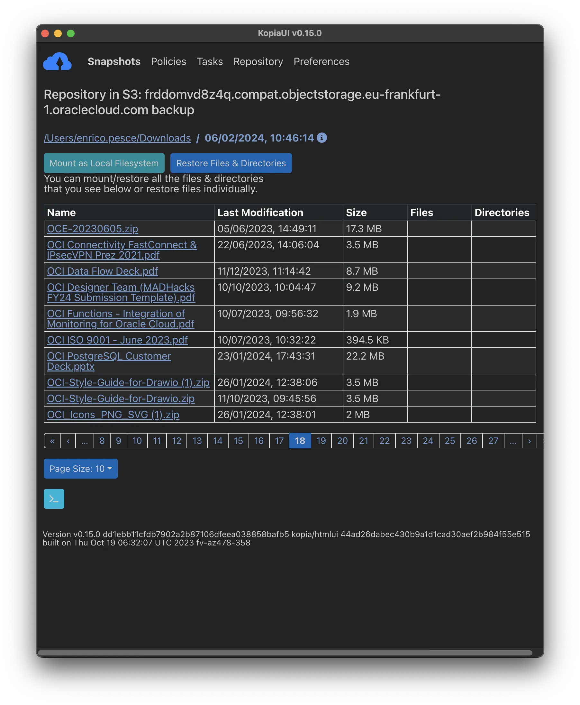
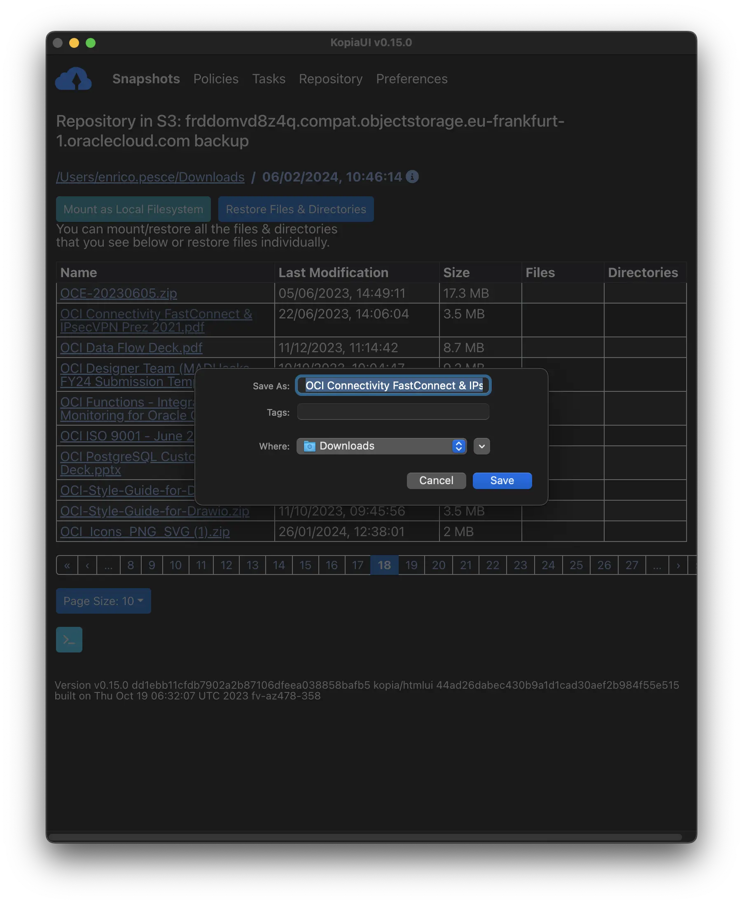
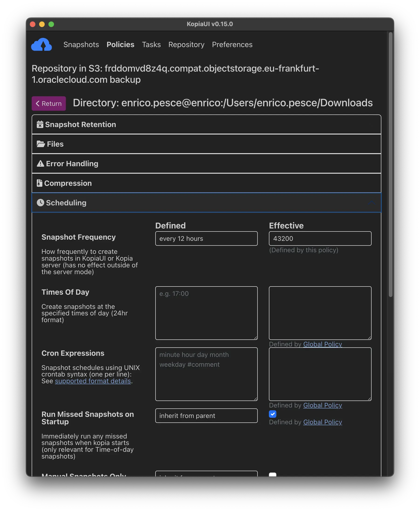

Vuoi fare backup dei tuoi dati in modo semplice e sicuro, senza spendere ore o denaro in strumenti o servizi complicati? Questo post fa per te.

Ti mostro come usare Kopia, uno strumento open source veloce e sicuro per il backup, insieme a OCI, un provider cloud scalabile e conveniente, per fare backup dei dati in 10 minuti o meno.

OCI Object Storage e' un servizio di cloud storage con queste caratteristiche:

- Puo' archiviare qualsiasi tipo di dato non strutturato nel formato nativo, come immagini, video, documenti o dati analitici.
- Include ridondanza, cifratura e controlli di integrita' per garantire durabilita' e sicurezza.
- Supporta piu' tier di storage, come standard, archive e glacier, offrendo flessibilita' di costo e performance.
- E' compatibile con l'API S3, quindi si integra facilmente con tool di backup come Kopia.
- Fornisce un namespace di storage dedicato e unico per ogni cliente, riducendo il rischio di bucket esposti o condivisi.

[Kopia.io](https://kopia.io/) e' uno strumento open source per il backup con queste caratteristiche:

- Supporta backup multipiattaforma di file e directory verso qualsiasi posizione di storage, cloud, rete o locale.
- Usa cifratura end-to-end, compressione e deduplicazione per proteggere e ottimizzare backup e restore.
- Permette di creare e gestire snapshot dei dati, basati su policy definite dall'utente, e ripristinarli quando necessario.
- Ha interfaccia a riga di comando, GUI e una modalita' server opzionale con API.
- E' veloce, affidabile e flessibile, e si integra con molti provider cloud come OCI, S3 e Google Cloud.

Vediamo come fare.

In questa implementazione ho usato la documentazione Kopia:

- [guida di installazione](https://kopia.io/docs/installation/)
- [guida getting started](https://kopia.io/docs/getting-started/)

Per creare un repository S3 su Kopia ti servono essenzialmente questi dettagli OCI:

- Bucket namespace
- Nome della regione

Questi dati compongono l'endpoint completo delle API compatibili S3:

**{bucketnamespace}.compat.objectstorage.{region}.oraclecloud.com**

Inoltre ti servono:

- Nome del bucket
- Utente con permessi e [customer access/secret key](https://docs.oracle.com/en-us/iaas/Content/Identity/Tasks/managingcredentials.htm#Working2)

Il comando, una volta raccolte le informazioni, sara' simile a questo, con chiavi mascherate:

```console
enrico.pesce@enrico ~ % kopia repository create s3 \
  --bucket=backup \
  --region=eu-frankfurt-1 \
  --endpoint=frddomvd8z4q.compat.objectstorage.eu-frankfurt-1.oraclecloud.com \
  --access-key=3fdsfdsfdsfsdf4543gtfreterter \
  --secret-access-key=dsdsadsadsadasdasdasdau7LF/KEjKZDhb8Q=
```

Se vuoi testare Object Storage e la compatibilita', puoi eseguire un test che effettua operazioni I/O nel repository:

```console
enrico.pesce@enrico ~ % kopia repository validate-provider
Opening 4 equivalent storage connections...
Validating storage capacity and usage
Validating blob list responses
Validating non-existent blob responses
Writing blob (5000000 bytes)
Validating conditional creates...
Validating list responses...
Validating partial reads...
Validating full reads...
Validating metadata...
Running concurrency test for 30s...
All good.
Cleaning up temporary data...
```

Per collegarti al repository:

```console
enrico.pesce@enrico ~ % kopia repository connect s3 \
  --bucket=backup \
  --region=eu-frankfurt-1 \
  --endpoint=frddomvd8z4q.compat.objectstorage.eu-frankfurt-1.oraclecloud.com \
  --access-key=3fdsfdsfdsfsdf4543gtfreterter \
  --secret-access-key=dsdsadsadsadasdasdasdau7LF/KEjKZDhb8Q=
```

Per controllare alcune informazioni, incluso uno snippet utile per riconnettersi senza usare credenziali in chiaro:

```console
enrico.pesce@enrico ~ % kopia repository status -t -s
Config file:         /Users/enrico.pesce/Library/Application Support/kopia/repository.config

Description:         Repository in S3: frddomvd8z4q.compat.objectstorage.eu-frankfurt-1.oraclecloud.com backup
Hostname:            enrico
Username:            enrico.pesce
Read-only:           false
Format blob cache:   15m0s

Storage type:        s3
Storage capacity:    unbounded
Storage config:      {
                       "bucket": "backup",
                       "endpoint": "frddomvd8z4q.compat.objectstorage.eu-frankfurt-1.oraclecloud.com",
                       "accessKeyID": ....

...To reconnect to the repository use:

$ kopia repository connect from-config --token eyJ2ZXJzaW9uIjoiMSIsInN0b3JhZ2UiOnsidHlwZSI6InMzIiwiY29uZmlnIjp7ImJ1Y2tldCI6ImJhY2t1cCIsImVuZHBvaW50IjoiZnJkZG9tdmQ4ejRxLmNvbXBhdC5vYmplY3RzdG9yYWdlLmVdsgfdsgdfsgfdsgo537hn9058jg9v-5869g5k89d-kf8946578bj06vfm056jvk0y458bnj908jg9v6k8fy989f658965jgy968jg94586b9k4869g84y6hgb8j69b8hj69hk8g95687h969bmtiomgufiunfbter
```

Ora hai un repository pronto per archiviare i tuoi dati con Kopia.

Per esempio puoi creare un backup della cartella Downloads con questo semplice comando usando le impostazioni predefinite:

```console
enrico.pesce@enrico ~ % kopia snapshot create $HOME/Downloads
Snapshotting enrico.pesce@enrico:/Users/enrico.pesce/Downloads ...
 * 0 hashing, 0 hashed (0 B), 5175 cached (14 GB), uploaded 202 B, estimating...
Created snapshot with root k24214076e958e761485b2af904f03b0b and ID de70da14f1c0264b3cbc4016dee67a7f in 0s
```

Completata la copia, puoi gia' elencare gli snapshot creati. Nel mio caso, dopo alcuni giorni:

```console
enrico.pesce@enrico ~ % kopia snapshot list $HOME/Downloads
enrico.pesce@enrico:/Users/enrico.pesce/Downloads
  2024-02-01 00:06:22 CET k081e4271a2db92d7eefe1ca035ff72c2 15.2 GB drwx------ files:11881 dirs:3150 (daily-5,monthly-2)
  2024-02-01 15:00:00 CET k5ed33706ce70d8984d89a8e8258a959f 15.2 GB drwx------ files:11882 dirs:3150 (latest-6..10,daily-4)
  + 4 identical snapshots until 2024-02-02 01:03:16 CET
  2024-02-02 13:31:20 CET k0db08b85d87ee5f366904d44eb149079 15.2 GB drwx------ files:11883 dirs:3150 (latest-5,daily-3,weekly-2)
  2024-02-05 11:52:21 CET k2e413b9843f14822438c57be23a1356a 15.2 GB drwx------ files:11895 dirs:3151 (latest-3..4,hourly-3..4,daily-2)
  + 1 identical snapshots until 2024-02-05 13:00:00 CET
  2024-02-06 10:46:14 CET k9eeba61e888e68e09ab26cd2aca07095 15.4 GB drwx------ files:11898 dirs:3158 (latest-1..2,hourly-1..2,daily-1,weekly-1,monthly-1,annual-1)
  + 1 identical snapshots until 2024-02-06 13:00:00 CET
```

Se non ami la console, ti consiglio la GUI semplice e comoda [KopiaUI](https://github.com/kopia/kopia/releases/tag/v0.15.0), molto intuitiva da usare. Ecco alcuni screenshot:

dove puoi controllare le cartelle protette:


vedere tutte le iterazioni di backup nel tempo con tag colorati:


la lista dei file protetti:


il ripristino dei file e' molto semplice:


la configurazione delle policy e' completa e granulare:


Ora non ti resta che provare Kopia e testarlo su OCI.
