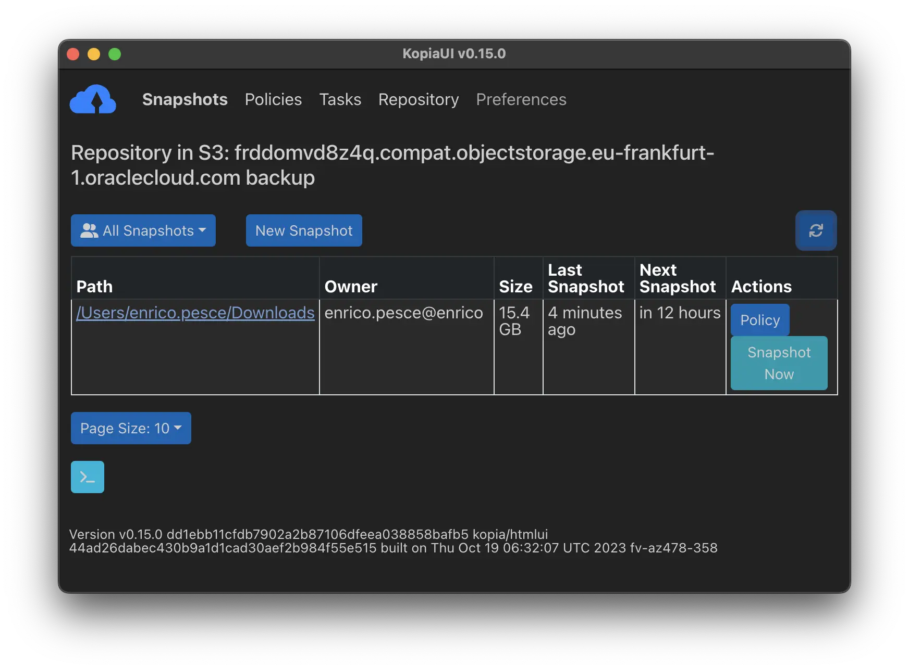
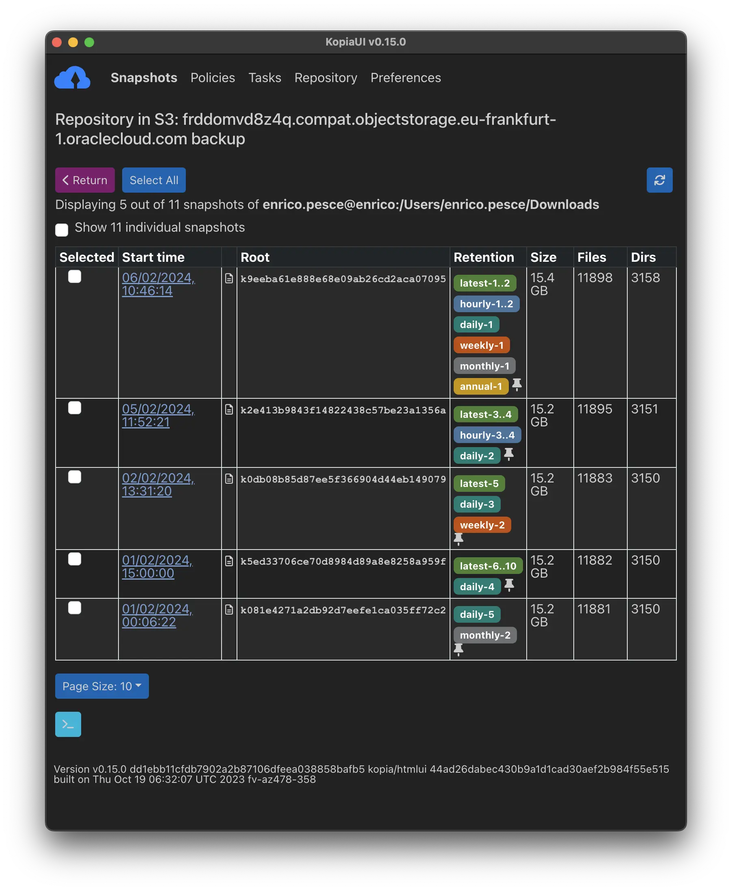
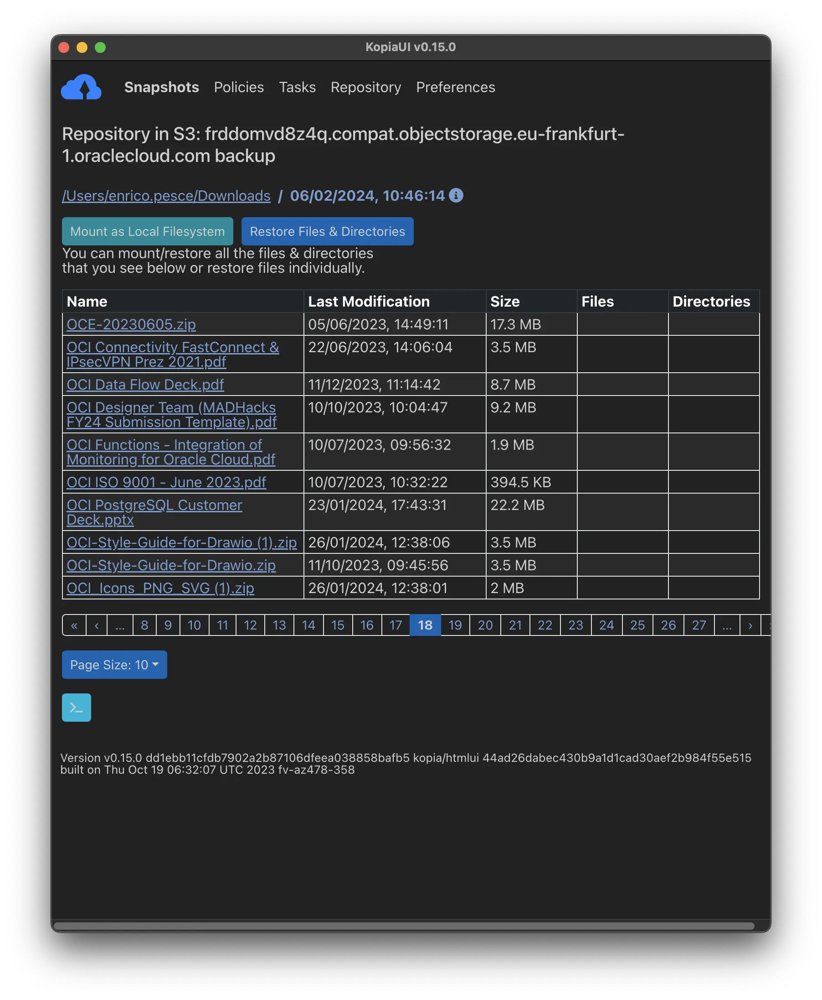
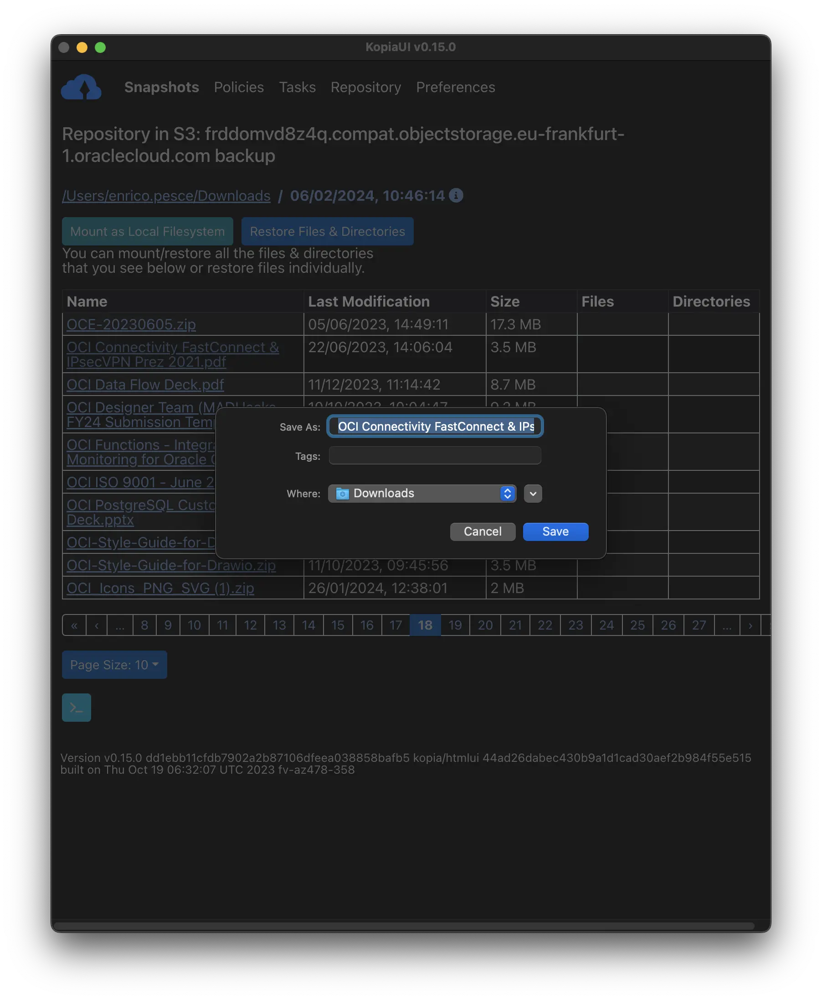
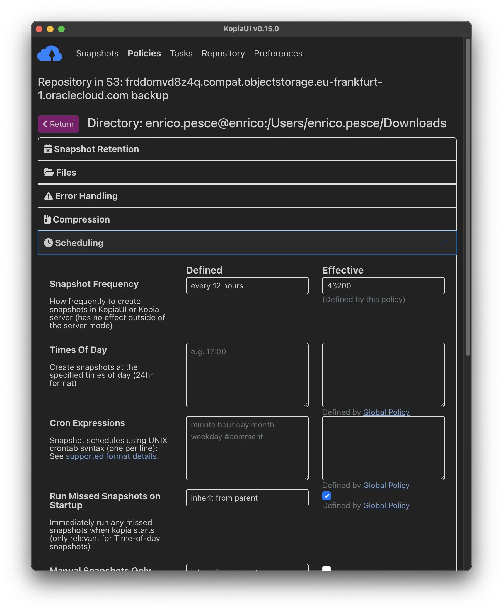

Do you want to backup your data easily and securely, without spending hours or money on complicated tools or services? If so, this post is for you!

I will show you how to use Kopia, a fast and secure open-source backup tool, and OCI, a scalable and cost-effective cloud storage provider, to backup your data in 10 minutes or less.

OCI object storage is a cloud storage service that offers the following features:

- It can store any type of unstructured data in its native format, such as images, videos, documents, or analytic data.
- It has built-in redundancy, encryption, and integrity checking to ensure data durability and security.
- It supports multiple storage tiers, such as standard, archive, and glacier, to offer cost and performance flexibility.
- It is compatible with the S3 API, which makes it easy to integrate with other backup tools, such as Kopia.
- It provides a dedicated and unique storage namespace for each customer, which reduces the risk of exposed or shared buckets.

[Kopia.io](https://kopia.io/) is an open-source backup tool that has the following features:

- It supports cross-platform backup of files and directories to any storage location, including cloud, network, and local storage.
- It uses end-to-end encryption, compression, and deduplication to secure and optimize your data backup and restore operations.
- It allows you to create and manage snapshots of your data, based on policies that you define, and restore them whenever you need them.
- It has both command-line and graphical user interfaces, as well as an optional server mode with API support.
- It is fast, reliable, and flexible, and integrates with many popular cloud storage providers, such as OCI, S3, Google Cloud, and more.

Now let's see how:

In this implementation I used this Kopia documentations:
- [installation guide](https://kopia.io/docs/installation/) 
- [getting-started guide](https://kopia.io/docs/getting-started/)

You essentially need these OCI details to create an S3 repository on Kopia:

- Bucket namespace
- Region name

These form the complete endpoint address of S3-compatible APIs:

**{bucketnamespace}.compat.objectstorage.{region}.oraclecloud.com**

Additionally, you'll need:

- Bucket name
- User with access rights and [customer access and secret key](https://docs.oracle.com/en-us/iaas/Content/Identity/Tasks/managingcredentials.htm#Working2)

The command, once you have the information, would look like this (keys are masked):

```console
enrico.pesce@enrico ~ % kopia repository create s3 \
  --bucket=backup \
  --region=eu-frankfurt-1 \
  --endpoint=frddomvd8z4q.compat.objectstorage.eu-frankfurt-1.oraclecloud.com \
  --access-key=3fdsfdsfdsfsdf4543gtfreterter \
  --secret-access-key=dsdsadsadsadasdasdasdau7LF/KEjKZDhb8Q=
```

If you want to test Object Storage and its compatibility, you can run a test that performs I/O operations in the repository:

```console
enrico.pesce@enrico ~ % kopia repository validate-provider
Opening 4 equivalent storage connections...
Validating storage capacity and usage
Validating blob list responses
Validating non-existent blob responses
Writing blob (5000000 bytes)
Validating conditional creates...
Validating list responses...
Validating partial reads...
Validating full reads...
Validating metadata...
Running concurrency test for 30s...
All good.
Cleaning up temporary data...
```
To connect on the repository:

```console
enrico.pesce@enrico ~ % kopia repository connect s3 \
  --bucket=backup \
  --region=eu-frankfurt-1 \
  --endpoint=frddomvd8z4q.compat.objectstorage.eu-frankfurt-1.oraclecloud.com \
  --access-key=3fdsfdsfdsfsdf4543gtfreterter \
  --secret-access-key=dsdsadsadsadasdasdasdau7LF/KEjKZDhb8Q=
```

To check some information, including a useful snippet for reconnecting without using clear credentials:

```console
enrico.pesce@enrico ~ % kopia repository status -t -s
Config file:         /Users/enrico.pesce/Library/Application Support/kopia/repository.config

Description:         Repository in S3: frddomvd8z4q.compat.objectstorage.eu-frankfurt-1.oraclecloud.com backup
Hostname:            enrico
Username:            enrico.pesce
Read-only:           false
Format blob cache:   15m0s

Storage type:        s3
Storage capacity:    unbounded
Storage config:      {
                       "bucket": "backup",
                       "endpoint": "frddomvd8z4q.compat.objectstorage.eu-frankfurt-1.oraclecloud.com",
                       "accessKeyID": ....

...To reconnect to the repository use:

$ kopia repository connect from-config --token eyJ2ZXJzaW9uIjoiMSIsInN0b3JhZ2UiOnsidHlwZSI6InMzIiwiY29uZmlnIjp7ImJ1Y2tldCI6ImJhY2t1cCIsImVuZHBvaW50IjoiZnJkZG9tdmQ4ejRxLmNvbXBhdC5vYmplY3RzdG9yYWdlLmVdsgfdsgdfsgfdsgo537hn9058jg9v-5869g5k89d-kf8946578bj06vfm056jvk0y458bnj908jg9v6k8fy989f658965jgy968jg94586b9k4869g84y6hgb8j69b8hj69hk8g95687h969bmtiomgufiunfbter
```

Now you have a ready repository to store your data with Kopia!

For example, you can create a folder backup with this simple command using default settings:

```console
enrico.pesce@enrico ~ % kopia snapshot create $HOME/Downloads
Snapshotting enrico.pesce@enrico:/Users/enrico.pesce/Downloads ...
 * 0 hashing, 0 hashed (0 B), 5175 cached (14 GB), uploaded 202 B, estimating...
Created snapshot with root k24214076e958e761485b2af904f03b0b and ID de70da14f1c0264b3cbc4016dee67a7f in 0s
```

Once the copy process is complete, you can already list the created snapshots, in my case after a few days:

```console
enrico.pesce@enrico ~ % kopia snapshot list $HOME/Downloads
enrico.pesce@enrico:/Users/enrico.pesce/Downloads
  2024-02-01 00:06:22 CET k081e4271a2db92d7eefe1ca035ff72c2 15.2 GB drwx------ files:11881 dirs:3150 (daily-5,monthly-2)
  2024-02-01 15:00:00 CET k5ed33706ce70d8984d89a8e8258a959f 15.2 GB drwx------ files:11882 dirs:3150 (latest-6..10,daily-4)
  + 4 identical snapshots until 2024-02-02 01:03:16 CET
  2024-02-02 13:31:20 CET k0db08b85d87ee5f366904d44eb149079 15.2 GB drwx------ files:11883 dirs:3150 (latest-5,daily-3,weekly-2)
  2024-02-05 11:52:21 CET k2e413b9843f14822438c57be23a1356a 15.2 GB drwx------ files:11895 dirs:3151 (latest-3..4,hourly-3..4,daily-2)
  + 1 identical snapshots until 2024-02-05 13:00:00 CET
  2024-02-06 10:46:14 CET k9eeba61e888e68e09ab26cd2aca07095 15.4 GB drwx------ files:11898 dirs:3158 (latest-1..2,hourly-1..2,daily-1,weekly-1,monthly-1,annual-1)
  + 1 identical snapshots until 2024-02-06 13:00:00 CET
```

If you're not a fan of the console, I recommend using a simple and convenient GUI, [KopiaUI](https://github.com/kopia/kopia/releases/tag/v0.15.0), which is very intuitive and easy to use. Here are some screenshots:

where you can check the protected folders

view all backup iterations over time with convenient color-coded tags

the list of protected files

file restoration is very simple

policy configuration is very comprehensive and granular


Now you just need to try Kopia and test it on OCI!
