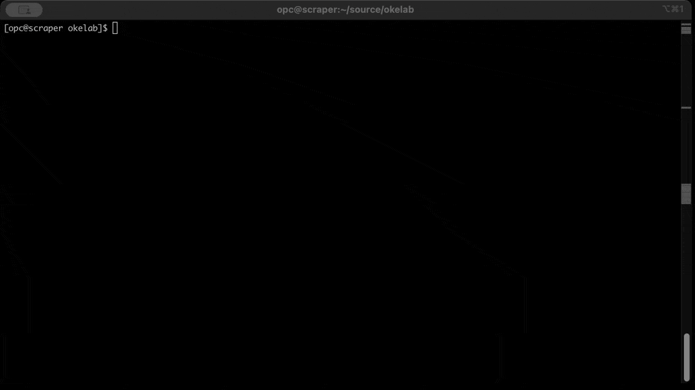

## I'm pleased to announce my first automation project on OCI

After 10 years of experience with DevOps practices, including automation and tools to produce IaC definitions and hundred of meetings with customers, I decided to create a tool that permits everyone to have a well-defined Kubernetes architecture without infrastructure competencies.

### Oracle Kubernetes engine deploy project (OKED)

OKED can help you to obtain a complete Kubernetes infrastructure with all network dependecies on OCI without having OCI expertees. 

The main requirements that motivated me to develop this project are as follows:

- **Simplicity**:: Customers ask to be up and running in minutes without any complex prompt and big infrastrucutre expertise.
- **Working**: Most online examples available are complex to understand and some are non-functional.
- **Well-architected**: Customers wants the best security practices and design applied as default.

The main features that differentiate this tool from the oci web console wizard and other terraform projects are:

- Automatic creation of the VCN and the subnetting; you only need to define the supernet CIDR.
- Automatic discovery and configuration of all availablity domains to spread nodes and obtain the maximum availability.
- Automatic discovery and configuration of the latest, correct, and optimized OKE node image to use.
- Kubernetes config file automagically generated, ready to use, for example, with export KUBECONFIG=$PWD/kubeconfig.
- Code where to start and extend day by day when the OCI skills grow.

You can find all the information in the GitHub page [here](https://github.com/enricopesce/oracle-kubernetes-engine-deploy).

Here a small demo in a fancy animated GIF:

