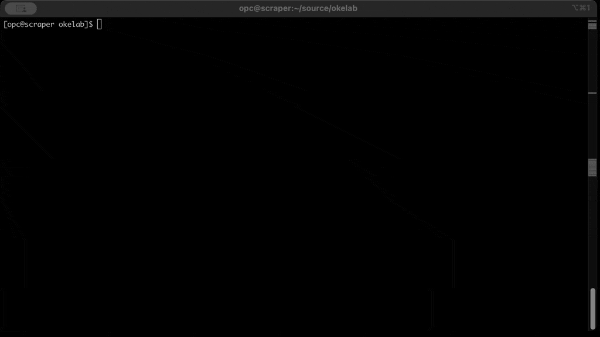

## My first OCI automation project

After 10 years of experience with DevOps practices, automation, infrastructure as code, and many customer discussions, I decided to build a tool that helps people deploy a well-defined Kubernetes architecture without needing deep infrastructure expertise.

### Oracle Kubernetes Engine Deploy project (OKED)

OKED helps you deploy a complete Kubernetes infrastructure on OCI, including the required network dependencies, without requiring OCI expertise.

The main requirements that motivated me to develop this project are as follows:

- **Simplicity**: Customers ask to be up and running in minutes without complex prompts or deep infrastructure expertise.
- **Working**: Most online examples available are complex to understand and some are non-functional.
- **Well-architected**: Customers want security best practices and sound design applied by default.

The main features that differentiate this tool from the OCI Console wizard and other Terraform projects are:

- Automatic creation of the VCN and the subnetting; you only need to define the supernet CIDR.
- Automatic discovery and configuration of all availability domains to spread nodes and improve availability.
- Automatic discovery and configuration of the latest, correct, and optimized OKE node image to use.
- Kubernetes config file generated and ready to use, for example with `export KUBECONFIG=$PWD/kubeconfig`.
- Code that can be extended as your OCI skills grow.

You can find all the information on the [GitHub project page](https://github.com/enricopesce/oracle-kubernetes-engine-deploy).

Here is a short demo:

