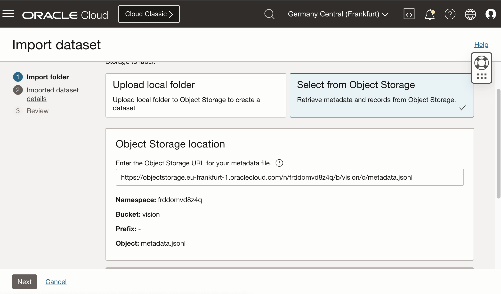
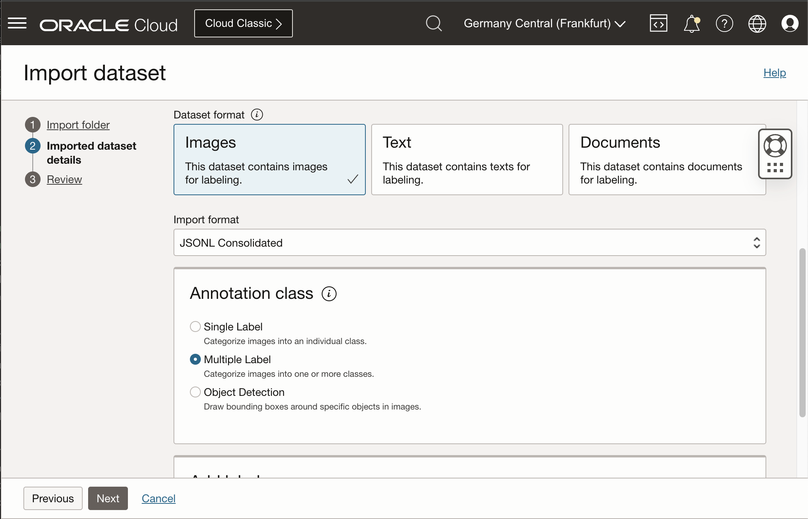
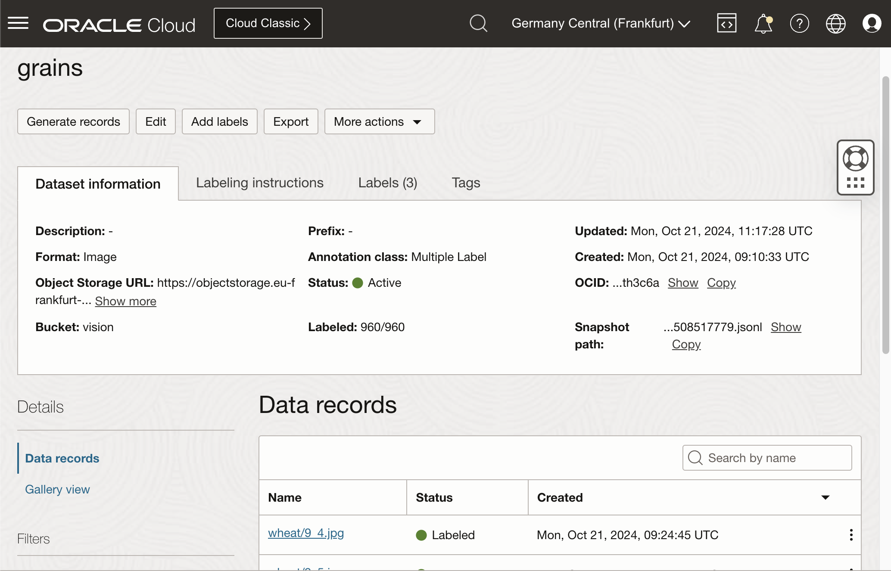
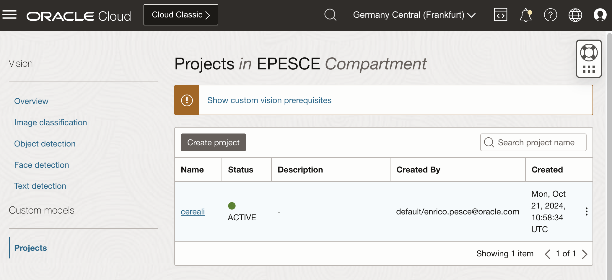
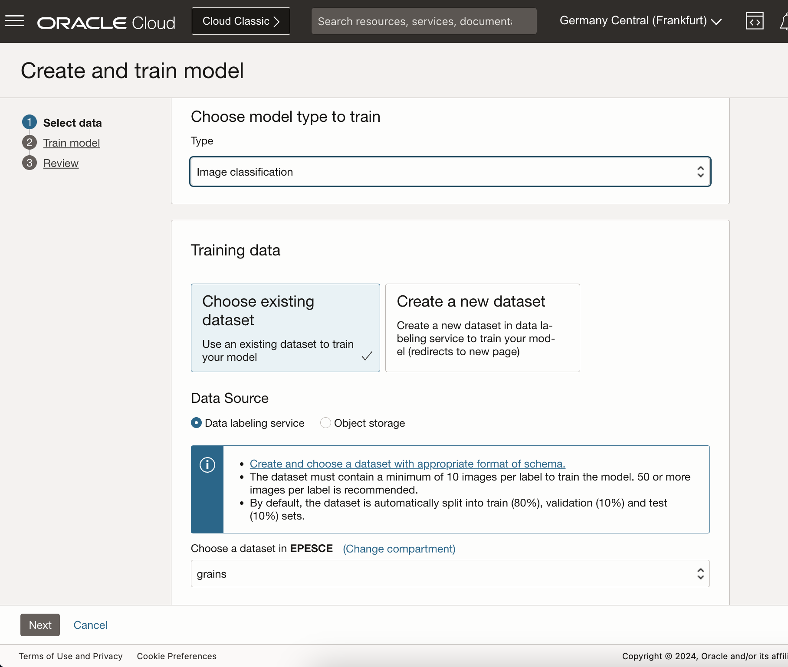
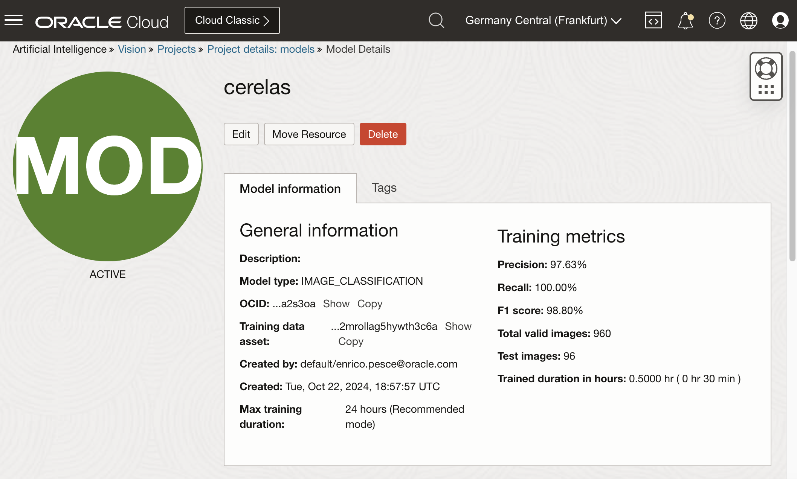
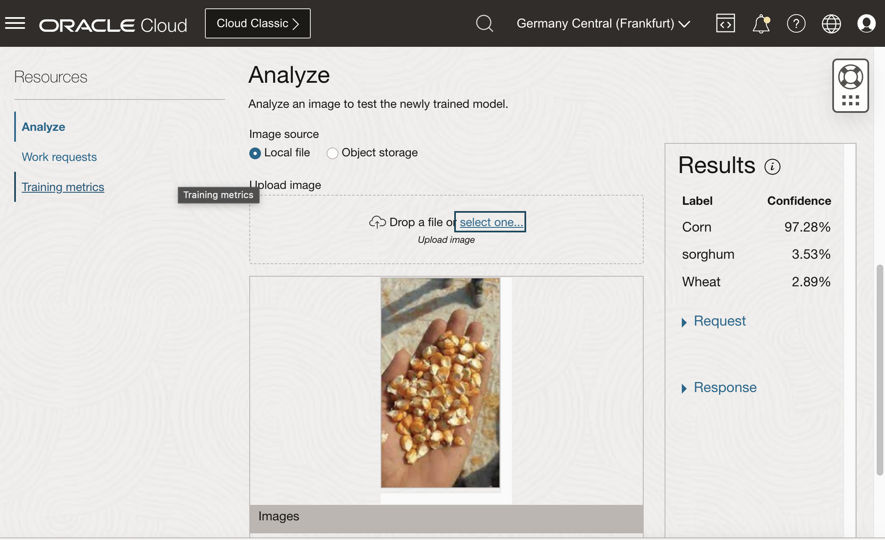
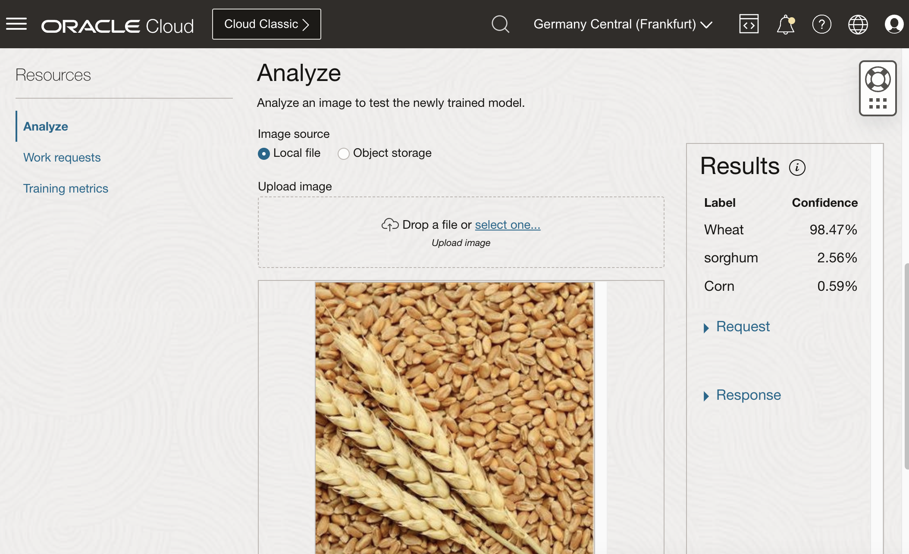
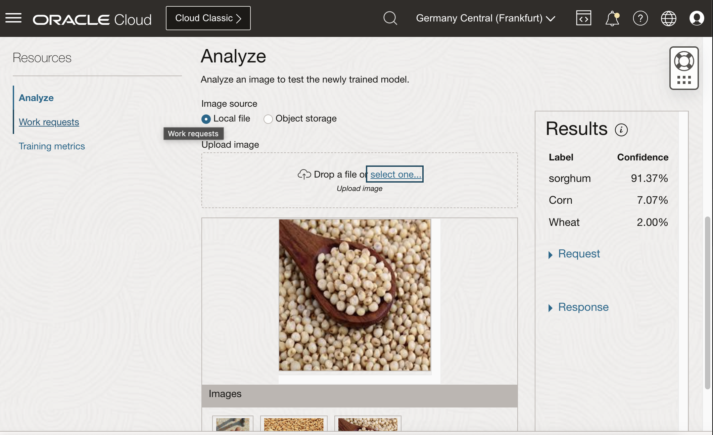

## Oci Vision: How do we identify cereals?

Is possible with OCI Vision service, without any infrastructure to manage and any ML/AI competence, to classify some images not included in the default Vision model?

Yes, it is possible! 

You can use OCI Vision to identify image content and use this feature to improve your software and business. 

### Let me show you how!

In this example, I used some cereals but it is only an example, you can extend the concept with everything visible.

Keep in mind that the data determines the quality of the result.

If you need to identify an object you need to train a model with multiple images of this and improve the quality of the model with more images.

I prepared a Python code to automate the process of augmenting images and producing more data, but initially, we need to start with some basic sample starting images.

All samples and the Python script are saved in this GitHub project: [https://github.com/enricopesce/oci-vision-cereals](https://github.com/enricopesce/oci-vision-cereals)

Folders are defined as follows:

```console
.
├── README.md
├── original
│   ├── corn
│   ├── sorghum
│   └── wheat
└── preprocessing.py
```

I downloaded, from Google Images, the images as samples to start, in the specific I downloaded three types of seeds:





- **Wheat**: is a grass widely cultivated for its seed, a cereal grain that is a staple food worldwide. It is typically ground into flour to make bread, pasta, and other foods.
- **Corn**: or maize, is one of the most widely grown grains in the world. It is used as food for humans, feed for livestock, and as a raw material in industry.
- **Sorghum**: is a versatile grain used for food, animal feed, and in the production of biofuels. It is drought-tolerant and important in semi-arid regions.

and saved them into the **original** folder grouped by the name of the cereal.

### Prepare the data for the OCI Vision neural network

These images are not sufficient to train a model, I experienced that a neural network to work well requires more images filtered and augmented.

In my little iteration, I prepared a script to preprocess and augment the original images using some basic techniques:

- Resize and crop
- Apply random rotation
- Apply random brightness
- Apply random horizontal flip

other techniques are well documented [here is a technical paper](https://arxiv.org/pdf/2301.02830).

[https://github.com/enricopesce/oci-vision-cereals/blob/main/preprocessing.py](https://github.com/enricopesce/oci-vision-cereals/blob/main/preprocessing.py)

Basically a final user can only run the script and generate from the original images other images optimized and augmented ready to be trained on the OCI services.

```console
python preprocessing.py
```

### Coping data on OCI Object Storage bucket

Before importing the processed files we need to copy them on an OCI Object Storage, space used by the next steps.

Create a bucket and copy all processed folders inside:

```console
oci os object bulk-upload \
 --namespace-name YOURNAMESPACENAME \
 --bucket-name YOURBUCKETNAME \
 --src-dir processed/ --content-type image/jpeg
```

Now we are ready to use OCI Artificial Intelligence service!

### Labeling data with OCI Data Label

To build a model, before, we need to classify the images, in other words, we need to assign for every image a tag corrispondig the content: wheat, corn or sorghum.

Yes is it a boring phase but fortunately the script, executed before, generated a JSONL file with all metadata to import on OCI Vision for you!!!

The new processed folder contains all processed images classified by a folder and the metadata file in JSON line format supported by OCI Vision with all data needed.

```console
.
├── README.md
├── original
│   ├── corn
│   ├── sorghum
│   └── wheat
├── preprocessing.py
└── processed
 ├── corn
 ├── metadata.jsonl
 ├── sorghum
 └── wheat
```

Now you have the same processed content in YOURBUCKETNAME ready to be imported!

Log-in on the OCI web console in your tenant and go to "Analticis & AI" --> "Machine Learning" --> "Data Labeling" --> "Dataset" --> "Import dataset"







### Create the model

Finally, we are ready to build the Oci Vision model and use it!

Create a new Project on the OCI Vision page and select the Data Label data.

"Analticis & AI" --> "Machine Learning" --> "Vision" --> "Project"



Go into the project and create a Model choose "Image classification" as the type and "grains" as a dataset (from the OCI Data Label)
 


Confirm all and continue to start the model build.

In this phase OCI build the model in automated way, the build time depends on the complexity of data, maximum 24 hours.

We don't need to set up any server or buy a GPU to train the model or split data and apply algorithms, all will done automatically by OCI Vision.



We have a very good F1 score for this model, now we can test it!

### Try the model

I have downloaded new random images related to the trained object and tested them:





We have a matching label for every image with over 90% confidence, a very good result! 

Now my OCI Vision can distinguish cereals!!

### Consideration

We have understood how OCI Vision is simple to use and get a classification service without any infrastructure to manage. 

The OCI part is very simple, we need principally to work on the image preprocess and augumentation, the big part of the time used was in the first step of images preparation.