## OCI Vision: How do we identify cereals?

Is it possible to use OCI Vision to classify images that are not included in the default Vision model, without managing infrastructure or needing deep ML expertise?

Yes, it is possible!

You can use OCI Vision to identify image content and use this feature to improve your software and business.

### Let me show you how!

In this example, I used cereals, but the same approach can be extended to many visible objects.

Keep in mind that the data determines the quality of the result.

If you need to identify a specific object, you need to train a model with multiple images of that object and improve model quality by adding more representative images.

I prepared Python code to automate image augmentation and produce more training data, but first we need a few sample images.

All samples and the Python script are saved in this GitHub project: [https://github.com/enricopesce/oci-vision-cereals](https://github.com/enricopesce/oci-vision-cereals)

Folders are defined as follows:

```console
.
├── README.md
├── original
│   ├── corn
│   ├── sorghum
│   └── wheat
└── preprocessing.py
```

I downloaded sample images for three types of seeds:

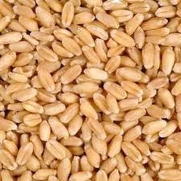
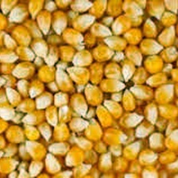
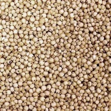

- **Wheat**: is a grass widely cultivated for its seed, a cereal grain that is a staple food worldwide. It is typically ground into flour to make bread, pasta, and other foods.
- **Corn**: or maize, is one of the most widely grown grains in the world. It is used as food for humans, feed for livestock, and as a raw material in industry.
- **Sorghum**: is a versatile grain used for food, animal feed, and in the production of biofuels. It is drought-tolerant and important in semi-arid regions.

I saved them into the **original** folder, grouped by cereal name.

### Prepare the data for the OCI Vision neural network

These images are not sufficient to train a useful model. In my testing, the model needed more filtered and augmented images to perform well.

In my little iteration, I prepared a script to preprocess and augment the original images using some basic techniques:

- Resize and crop
- Apply random rotation
- Apply random brightness
- Apply random horizontal flip

Other techniques are documented [in this paper](https://arxiv.org/pdf/2301.02830).

You can find the Python script here: [https://github.com/enricopesce/oci-vision-cereals/blob/main/preprocessing.py](https://github.com/enricopesce/oci-vision-cereals/blob/main/preprocessing.py)

The script generates optimized and augmented images from the original samples, ready for training on OCI services.

```console
python preprocessing.py
```

### Copy data to an OCI Object Storage bucket

Before importing the processed files, copy them to an OCI Object Storage bucket. The next steps use this bucket as the data source.

Create a bucket and copy all processed folders inside:

```console
oci os object bulk-upload \
 --namespace-name YOURNAMESPACENAME \
 --bucket-name YOURBUCKETNAME \
 --src-dir processed/ --content-type image/jpeg
```

Now we are ready to use OCI Artificial Intelligence service!

### Label data with OCI Data Labeling

Before building the model, we need to classify the images. In other words, every image needs a label corresponding to its content: wheat, corn, or sorghum.

This can be a repetitive phase, but the preprocessing script already generated a JSONL metadata file that can be imported into OCI Vision.

The new processed folder contains all processed images classified by a folder and the metadata file in JSON line format supported by OCI Vision with all data needed.

```console
.
├── README.md
├── original
│   ├── corn
│   ├── sorghum
│   └── wheat
├── preprocessing.py
└── processed
 ├── corn
 ├── metadata.jsonl
 ├── sorghum
 └── wheat
```

Now the processed content is in `YOURBUCKETNAME` and ready to import.

Sign in to the OCI Console and go to **Analytics & AI** > **Machine Learning** > **Data Labeling** > **Dataset** > **Import dataset**.

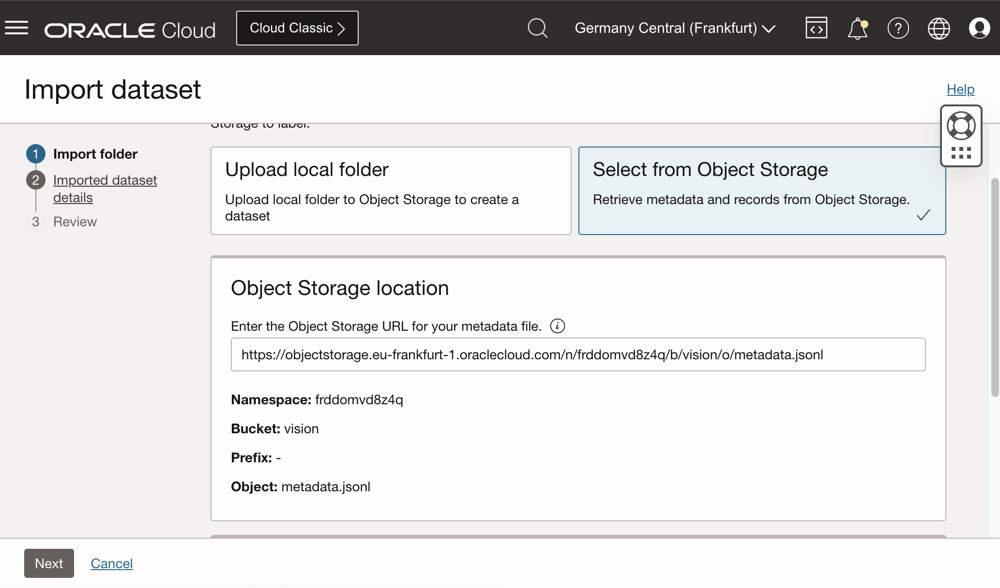

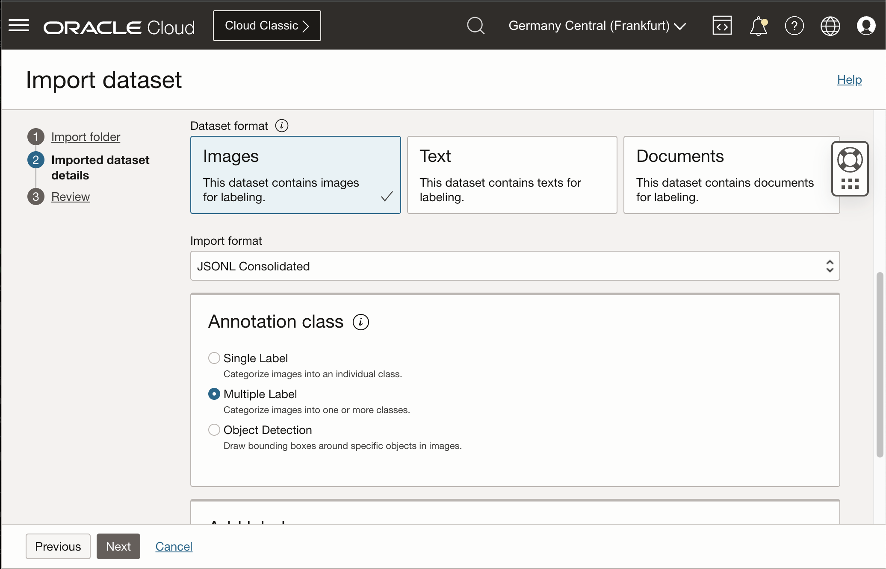

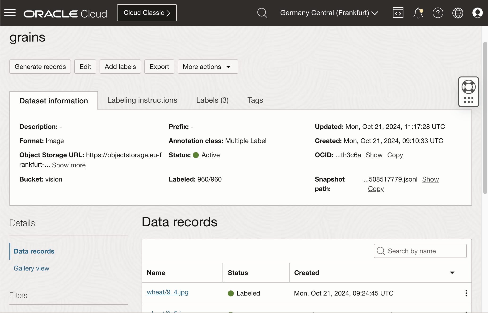

### Create the model

Finally, we are ready to build and use the OCI Vision model.

Create a new Project on the OCI Vision page and select the Data Label data.

Go to **Analytics & AI** > **Machine Learning** > **Vision** > **Project**.

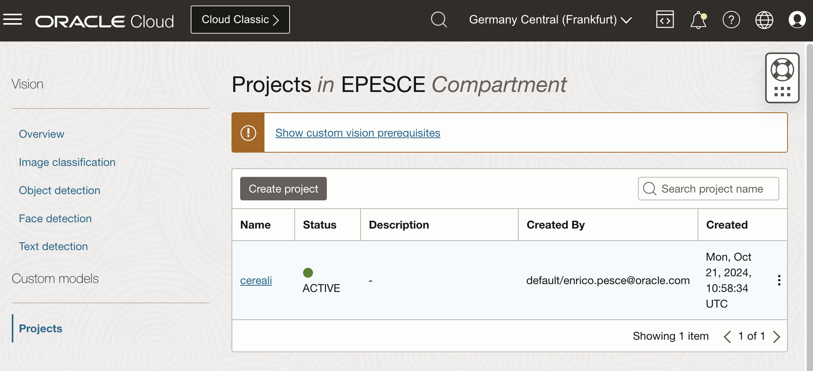

Open the project and create a model. Choose **Image classification** as the type and use the `grains` dataset from OCI Data Labeling.

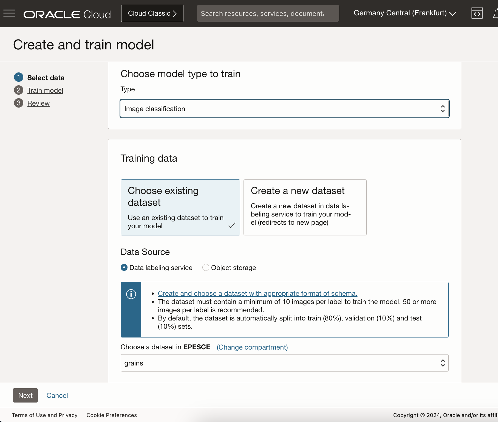

Confirm all and continue to start the model build.

In this phase, OCI builds the model automatically. Build time depends on the complexity of the data and can take up to 24 hours.

You do not need to set up servers, buy a GPU, split the data manually, or apply algorithms yourself. OCI Vision handles the training workflow.

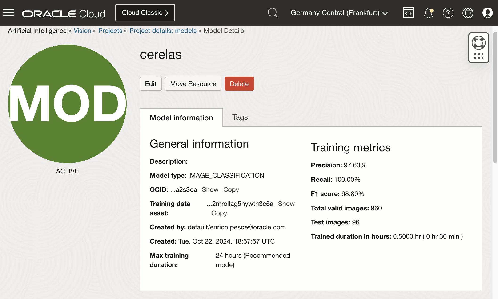

We have a very good F1 score for this model, now we can test it!

### Try the model

I have downloaded new random images related to the trained object and tested them:

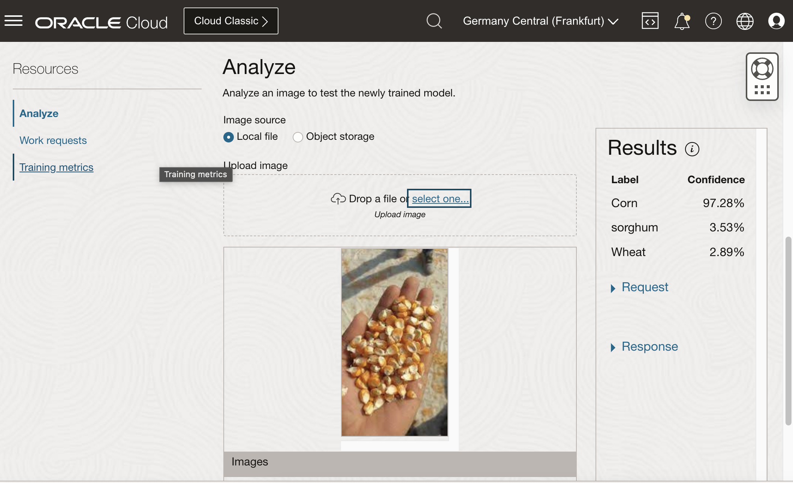
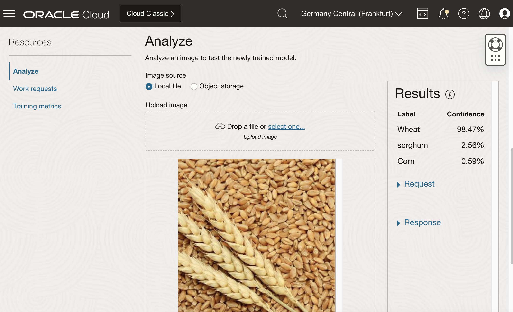
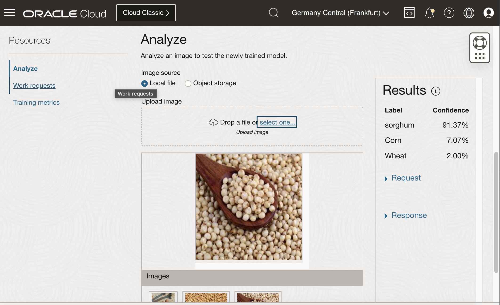

The model returned the correct label for every image with more than 90% confidence, which is a good result for this simple example.

Now my OCI Vision can distinguish cereals!!

### Consideration

OCI Vision makes it straightforward to build an image classification service without managing infrastructure.

The OCI part is simple. Most of the work is in image preprocessing, augmentation, and data preparation.
